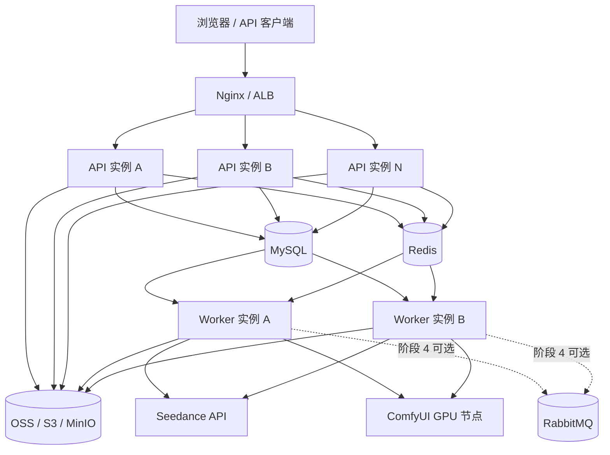
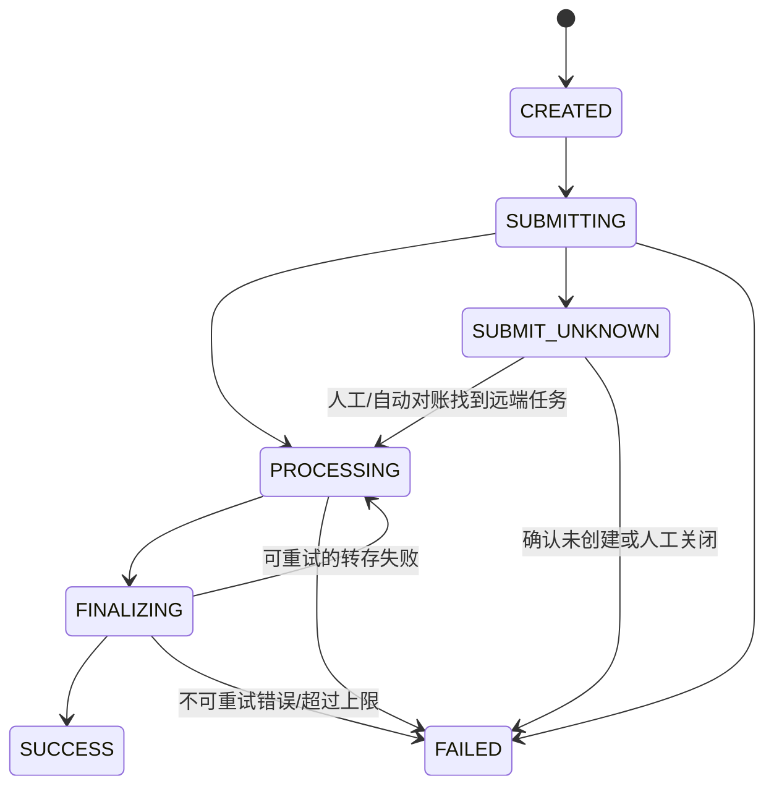

# SeedanceGenarate 分布式改造阶段实施方案

> 文档状态：Draft / 可执行方案
> 编写日期：2026-08-08
> 适用项目：SeedanceGenarate 后端
> 目标：在不立即拆成大量微服务的前提下，将当前 Spring Boot 单体改造成可安全横向扩展的 **API 集群 + Worker 集群**。

---

## 1. 文档目的

本文档用于指导 SeedanceGenarate 从当前单实例部署逐步演进为分布式架构，给出：

- 当前架构中的单机假设和分布式风险；
- 中间件选型与暂不引入项；
- 每个改造阶段的目标、代码范围、表结构、配置和实施步骤；
- 一致性、幂等、任务状态机、失败恢复和消息可靠性设计；
- 测试、灰度、监控、回滚与验收标准；
- RabbitMQ、MongoDB、Elasticsearch 的引入时机和决策门槛。

本文档强调 **渐进式改造**。每个阶段完成后都应可独立上线、可观察、可回滚，不要求一次性完成全部目标。

---

## 2. 核心结论

### 2.1 推荐技术组合

近期推荐：

```text
MySQL + Redis + OSS + Nginx/云负载均衡
```

中期按任务规模选择：

```text
MySQL + Redis + OSS + RabbitMQ + API 集群 + Worker 集群
```

当前不建议引入：

- MongoDB；
- Elasticsearch；
- Nacos 等服务注册中心；
- Kubernetes（除非已有统一容器平台）；
- 大规模微服务拆分。

### 2.2 组件职责必须明确

| 组件 | 职责 | 是否权威数据源 |
|---|---|---:|
| MySQL | 用户、任务、流水线、计费、幂等记录、作业、Outbox、Webhook 投递状态 | 是 |
| Redis | 分布式限流、短期协调、SSE 跨实例通知、可丢缓存 | 否 |
| OSS/S3/MinIO | 图片、视频等二进制产物 | 是（文件层面） |
| RabbitMQ（可选） | 任务传输、削峰、消费者解耦、重试与死信 | 否 |
| API 实例 | 鉴权、校验、创建任务、查询、SSE 连接 | 否 |
| Worker 实例 | 提交提供方、轮询、结果转存、终态落库、异步副作用 | 否 |

### 2.3 关键原则

1. **MySQL 是业务状态唯一真相。** Redis 和 RabbitMQ 都不能成为任务状态的唯一来源。
2. **文件不落实例永久磁盘。** 生成结果统一进入 OSS；容器或主机本地目录只允许作为临时缓冲。
3. **不追求“消息恰好一次”。** 使用“至少一次投递 + 幂等消费 + 数据库唯一约束”。
4. **不用 Redis 分布式锁代替数据库约束。** 锁可以降低竞争，唯一索引和条件更新负责最终正确性。
5. **外部网络调用不放在数据库长事务内。** 使用状态机、租约和短事务协调。
6. **先模块化单体，后按运行角色拆部署。** 初期保留一个仓库、一个制品，通过 `api/worker/all` 角色运行。
7. **所有改造采用 Expand → Migrate → Contract。** 先加新字段并兼容，再迁移数据，最后删除旧路径。

---

## 3. 当前架构基线与主要风险

### 3.1 已具备的良好基础

当前代码并非必须推倒重来，以下设计可直接保留：

- `VideoEngine` + `VideoEngineRegistry` 已将 Seedance、ComfyUI 提供方解耦；
- ComfyUI 任务已持久化 `nodeId`，轮询可以回到原节点；
- `video_task` 是生成任务的主生命周期表；
- MySQL 已保存 Token，登录态本身可被多个实例共享；
- 计费、模型开放、任务提交已有 Service 抽象；
- SSE 明确采用“数据库为真相、推送为通知”的思路；
- `webhook_delivery` 已具备基础幂等键与重试字段；
- 素材图片已使用 OSS。

### 3.2 必须解决的单机假设

| 问题 | 当前位置 | 多实例后果 |
|---|---|---|
| 生成结果保存到 `data/videos/` | `VideoDownloadServiceImpl`、`VideoController`、`ApiVideoController` | A 实例生成，B 实例读取时 404 |
| 限流桶保存在 JVM Map | `TokenBucketRateLimitServiceImpl` | N 个实例可获得约 N 倍额度 |
| SSE 连接保存在 JVM Map | `TaskStreamManager` | Worker A 完成任务，连接在 API B，B 收不到本地事件 |
| 所有实例执行相同轮询器 | `VideoTaskPoller` | 重复轮询、重复下载、重复终态处理 |
| 流水线使用本地单线程 Executor | `PipelineConfig`、`PipelineServiceImpl` | 重启丢队列；多实例不再是“全局单线程” |
| 启动时统一恢复 RUNNING 流水线 | `PipelineStartupRecover` | A 正在执行时，B 启动可能误改状态 |
| Spring ApplicationEvent 仅进程内有效 | `TaskStatusChangedEvent`、`TaskSubmittedEvent` 的监听器 | 跨实例事件不可见；提交后宕机可能丢副作用 |
| Webhook 定时扫描无领取租约 | `WebhookDispatcher` | 多实例可能同时投递同一条记录 |
| 计费采用“先查再插” | `CostRecordServiceImpl` | 并发下重复计费或累计金额丢更新 |
| `schema.sql` 启动时总是执行 | `spring.sql.init.mode=always` | 多实例同时执行 DDL，迁移不可控 |
| ComfyUI round-robin 计数在 JVM | `ComfyUiNodeScheduler` | 每个实例从相同起点调度，负载可能倾斜 |

### 3.3 Redis 当前状态

项目已经加入：

- `spring-boot-starter-data-redis`；
- `spring.data.redis.*` 配置。

但当前业务代码尚未实际使用 Redis。第一阶段需要明确 Redis 用途，而不是仅接入客户端。

---

## 4. 目标架构



### 4.1 运行角色

初期保持同一个代码仓库和同一个 JAR，通过配置控制 Bean 是否启用：

```yaml
app:
  role: ${APP_ROLE:all} # all | api | worker
```

建议语义：

| 角色 | 启用内容 |
|---|---|
| `all` | Controller、SSE、任务执行器、定时维护任务；兼容单机开发 |
| `api` | Controller、鉴权、任务创建与查询、SSE；不执行后台任务 |
| `worker` | 提交、轮询、终态处理、Webhook、Outbox；不暴露业务 Controller |

可使用：

```java
@ConditionalOnProperty(name = "app.role", havingValue = "worker")
```

实际实现时应支持 `all`，或封装一个自定义条件使 `all` 同时加载 API 与 Worker Bean。

### 4.2 目标请求链路

#### 创建任务

```text
客户端
  → API 校验身份、限流、模型和参数
  → MySQL 事务：创建业务任务 + 创建持久化作业/Outbox
  → 立即返回业务 taskId
  → Worker 领取作业
  → 调用 Seedance/ComfyUI
  → 回写 providerTaskId、nodeId、PROCESSING
```

#### 任务完成

```text
Worker 领取到期的 PROCESSING 任务
  → 调用对应提供方 poll
  → 成功时 CAS 抢占 FINALIZING
  → 将远端产物流式写入 OSS
  → MySQL 短事务：SUCCESS + 计费 + Outbox
  → Redis Pub/Sub 通知所有 API 实例
  → 持有该用户 SSE 连接的 API 实例进行推送
```

---

## 5. 分阶段总览

> 工作量为单名熟悉项目的后端工程师的粗略人日，不包含产品需求变更、等待测试环境和外部基础设施审批。

| 阶段 | 目标 | 建议工作量 | 能否多 API 实例 |
|---|---|---:|---:|
| 阶段 0 | 基线、迁移机制、幂等约束、安全配置 | 3～5 人日 | 否 |
| 阶段 1 | OSS 产物、Redis 限流与 SSE、集群安全定时任务 | 7～12 人日 | 是，后台仍建议单 Worker |
| 阶段 2 | MySQL 持久化作业、租约、任务状态机、流水线去本地队列 | 10～18 人日 | 是 |
| 阶段 3 | API/Worker 角色拆分、Outbox、可靠终态副作用 | 8～15 人日 | 是，Worker 也可横向扩容 |
| 阶段 4 | 按指标选择 RabbitMQ | 7～12 人日 | 是，异步吞吐进一步提升 |
| 阶段 5 | 可观测性、容器化、灰度、容灾和容量治理 | 5～10 人日 | 生产完备 |
| 阶段 6 | 按真实需求引入搜索/分析组件 | 待定 | 不影响主链路 |

推荐上线节奏：

1. 阶段 0 单独上线；
2. 阶段 1 先单实例验证 OSS/Redis，再扩成双 API 实例；
3. 阶段 2、3 先让一台 Worker 工作，再增加第二台验证并发领取；
4. RabbitMQ 必须经过容量数据决策，不作为阶段 1 的前置依赖。

---

# 阶段 0：改造准备、数据库迁移与一致性兜底

## 0.1 阶段目标

- 建立可重复、可审计的数据库迁移机制；
- 修复在单机下不明显、在多实例下会放大的并发问题；
- 为后续双写、灰度和快速回滚准备开关；
- 建立改造前性能与正确性基线。

## 0.2 引入 Flyway 或 Liquibase

推荐 Flyway，原因是当前表结构以 SQL 为主，迁移成本最低。

### 实施步骤

1. 加入 `flyway-core` 和 MySQL 支持依赖；
2. 将当前完整结构整理为基线迁移；
3. 已有数据库采用 baseline 方式纳管；
4. 后续每次变更使用不可修改的版本文件，例如：

```text
src/main/resources/db/migration/
  V1__baseline.sql
  V2__distributed_constraints.sql
  V3__artifact_storage.sql
  V4__task_leases.sql
  V5__async_job_and_outbox.sql
```

5. 生产环境关闭：

```yaml
spring:
  sql:
    init:
      mode: never
```

6. 数据库迁移由一个发布任务执行，或依赖 Flyway 的数据库锁；不要让多个实例继续执行 `schema.sql` 中可忽略错误的重复 ALTER。

### 注意事项

- 上线前先导出当前生产 `SHOW CREATE TABLE`，不要假设其结构与仓库 `schema.sql` 完全一致；
- 基线脚本一旦在共享环境执行，不再修改原文件，只新增更高版本；
- 所有新增字段先允许为空，完成回填后再考虑 `NOT NULL`。

## 0.3 增加数据库最终幂等约束

### 计费

当前 `cost_record.task_id` 只有普通索引。建议：

1. 先检查并清理重复数据；
2. 增加唯一约束：

```sql
ALTER TABLE cost_record
  ADD UNIQUE KEY uk_cost_record_task (task_id);
```

如果未来一条任务可能有扣费、退款、补扣等多类流水，则改为：

```sql
UNIQUE KEY uk_cost_record_task_type (task_id, record_type)
```

3. 计费逻辑从“查询是否存在后插入”改为“直接插入，唯一键冲突视为已处理”；
4. 用户累计消费必须原子累加：

```sql
UPDATE app_user
SET total_cost = total_cost + ?
WHERE id = ?;
```

不要继续读取旧值后再覆盖写入。

### 任务状态

所有终态更新增加前置状态条件：

```sql
UPDATE video_task
SET status = 'SUCCESS', ...
WHERE id = ? AND status = 'FINALIZING';
```

受影响行数为 0 表示：

- 已被其他 Worker 完成；
- 当前 Worker 的租约已失效；
- 状态不允许此次转换。

不得再无条件覆盖。

### 其他唯一键

逐项确认：

- `user_asset(user_id, url)`：已具备，继续捕获并发唯一键冲突；
- `webhook_delivery(task_id, status)`：已具备，后续建议改用内部业务任务 ID 或 `video_task_id`；
- `api_call_log.request_id`：已具备；
- 流水线运行作业：阶段 2 增加独立业务幂等键。

## 0.4 引入内部业务任务 ID

当前 `video_task.task_id` 实际上偏向提供方返回的任务 ID。异步提交后，API 必须在调用外部提供方之前返回一个稳定 ID，因此建议区分：

| 字段 | 用途 |
|---|---|
| `id` | MySQL 内部主键，服务内部关联优先使用 |
| `biz_task_id` | 本系统生成的公开任务 ID，创建行时立即生成 |
| `provider_task_id` | Seedance/ComfyUI 返回的远端任务 ID |

### 兼容迁移顺序

1. 新增 `biz_task_id`、`provider_task_id`，暂时允许空；
2. 将旧 `task_id` 复制到 `provider_task_id`；
3. 为历史记录生成 `tsk_legacy_{video_task.id}` 形式的 `biz_task_id`；
4. 新代码写 `biz_task_id`、兼容旧 `task_id`，并把提供方返回值写入 `provider_task_id`；
5. 新接口返回 `biz_task_id`，查询接口在过渡期同时支持 `biz_task_id` 与旧 `task_id`；
6. `api_call_log`、`webhook_delivery`、`pipeline_node`、`user_asset` 的内部字符串引用回填为 `biz_task_id`，旧外部 ID 仍由 `video_task` 兼容查询；
7. 全部迁移稳定后，再决定是否删除或重命名旧 `task_id`。

建议格式：

```text
tsk_<UUIDv7/ULID>
```

选择 UUIDv7/ULID 可以减少随机 UUID 对 B-Tree 索引的离散写入。

## 0.5 增加灰度开关

建议预先定义：

```yaml
feature:
  artifact-storage-v2: ${FEATURE_ARTIFACT_STORAGE_V2:false}
  redis-rate-limit: ${FEATURE_REDIS_RATE_LIMIT:false}
  redis-task-events: ${FEATURE_REDIS_TASK_EVENTS:false}
  durable-job: ${FEATURE_DURABLE_JOB:false}
  outbox-events: ${FEATURE_OUTBOX_EVENTS:false}
```

开关要求：

- 支持按环境开启；
- 关键迁移支持双读或双写；
- 日志必须输出当前启用的实现；
- 删除旧实现前至少经历一个稳定观察周期。

## 0.6 密钥与生产配置治理

当前配置文件存在可直接使用样式的 API Key、OSS 凭证和 Redis 密码默认值。阶段 0 必须：

1. 移除所有敏感默认值；
2. 轮换已经进入代码、日志或历史提交的凭证；
3. 使用环境变量、Docker Secret、KMS 或云 Secret Manager；
4. Redis、MySQL、OSS 仅允许内网访问；
5. 生产关闭 MyBatis SQL stdout 日志；
6. 不在错误响应中输出外部服务密钥、签名和完整连接地址。

## 0.7 建立基线数据

上线改造前至少记录：

- API QPS、P50/P95/P99 延迟；
- 每分钟任务提交数；
- PROCESSING 任务数和最长运行时长；
- 提供方轮询调用次数；
- 任务成功率、失败率；
- 单任务平均结果大小；
- MySQL 连接数、慢查询、CPU；
- 本地 `data/videos/` 日增长；
- Webhook 成功率与重试数。

## 0.8 阶段验收

- [ ] 新环境可仅通过 Flyway 建库；
- [ ] 已有环境可安全 baseline，不重复执行历史 DDL；
- [ ] 计费唯一键存在，重复终态调用不会重复扣费；
- [ ] 用户累计消费使用原子更新；
- [ ] 关键状态更新具有 CAS 条件；
- [ ] 敏感配置不再有真实默认值，旧凭证已轮换；
- [ ] 改造前基线指标已记录；
- [ ] 所有功能在单实例模式保持兼容。

## 0.9 回滚策略

- 数据库采用只增不删；旧版本暂时忽略新字段；
- Flyway 迁移不执行破坏性回滚，应用版本回滚即可；
- 若唯一索引创建失败，先停止发布并清理重复数据，不能跳过约束继续上线。

---

# 阶段 1：API 无状态化——OSS、Redis 与集群安全定时任务

## 1.1 阶段目标

完成后应支持：

- 两个及以上 API 实例挂在负载均衡后；
- 任意实例都能读取同一份生成结果；
- 限流额度在所有实例之间一致；
- Worker 完成任务后，所有 API 实例都能收到通知；
- 在后台任务尚未完全分布式化前，只允许一个逻辑 Worker 执行关键扫描。

## 1.2 生成产物迁移到 OSS

这是阶段 1 的最高优先级。

### 1.2.1 抽象统一存储接口

本阶段已落地 `ArtifactStorage` + `OssArtifactStorage`，正式产物只写 OSS；`LocalArtifactStorage` 暂未作为生产实现，历史本地文件由 Controller fallback 读取。

建议新增：

```java
public interface ArtifactStorage {
    StoredArtifact put(
        String objectKey,
        InputStream input,
        String contentType,
        Long contentLength
    );

    InputStream get(String objectKey);

    boolean exists(String objectKey);

    void delete(String objectKey);

    String createSignedGetUrl(String objectKey, Duration ttl);
}
```

实现：

- `LocalArtifactStorage`：仅用于开发兼容；
- `OssArtifactStorage`：生产默认；
- 未来可增加 `S3ArtifactStorage`、`MinioArtifactStorage`。

不要让 Controller 再直接使用 `Paths.get("data/videos/")`。

### 1.2.2 数据字段

最小可行方案是在 `video_task` 增加：

```sql
ALTER TABLE video_task
  ADD COLUMN storage_type VARCHAR(16) NULL,
  ADD COLUMN artifact_key VARCHAR(512) NULL,
  ADD COLUMN artifact_content_type VARCHAR(128) NULL,
  ADD COLUMN artifact_size BIGINT NULL,
  ADD COLUMN artifact_etag VARCHAR(128) NULL,
  ADD COLUMN artifact_expires_at DATETIME NULL;
```

保留 `video_url` 作为过渡字段，不立即删除。

如果未来一个任务会有封面、多个视频版本、缩略图等多个产物，再升级为独立 `task_artifact` 表；当前只有一个主产物时不必提前复杂化。

### 1.2.3 Object Key 规范

建议使用确定性路径：

```text
outputs/{yyyy}/{MM}/{dd}/{bizTaskId}/result.{ext}
```

优点：

- Worker 重试会覆盖或命中同一对象，避免产生重复文件；
- 可按任务定位；
- 便于生命周期管理和审计。

扩展名不能只信 URL，优先级建议：

1. 提供方响应的 Content-Type；
2. 响应文件名；
3. 文件头识别；
4. 最后才使用默认扩展名。

### 1.2.4 下载与播放链路

推荐：

1. 后端校验任务归属和权限；
2. 生成 1～5 分钟的 OSS 签名 URL；
3. 返回 302 重定向，或返回 URL 给前端；
4. 大文件不经过 Spring Boot 中转，避免占用 API 线程、带宽和堆外缓冲。

如果业务要求隐藏 OSS 地址，可使用 CDN 私有鉴权或 Nginx `X-Accel-Redirect`，而不是长期由 Java 进程复制视频字节。

### 1.2.5 旧文件迁移

迁移程序应：

1. 查询 `video_url LIKE 'data/videos/%'` 的记录；
2. 检查本地文件是否存在；
3. 上传到确定性 object key；
4. 校验 ETag/大小；
5. 回写新字段；
6. 保留本地文件一个观察周期；
7. 最后再删除本地文件。

必须可重复执行，并使用 `artifact_key IS NULL` 作为迁移条件。

### 1.2.6 清理策略

- OSS 配置 48 小时或产品定义周期的 Lifecycle；
- 数据库保留 `artifact_expires_at`；
- API 在签名 URL 前判断是否过期；
- `VideoCleanupTask` 先改为兼容模式，确认 OSS 生命周期稳定后停用本地删除逻辑；
- 如果需要同步清理数据库元数据，使用集群安全维护任务，而不是扫描每个实例磁盘。

## 1.3 Redis Key 与序列化规范

建议统一前缀：

```text
{env}:seedance:{module}:{business-key}
```

示例：

```text
prod:seedance:rate:user:123:generate
prod:seedance:rate:ip:1.2.3.4:register
prod:seedance:event:task-status
prod:seedance:lock:video-poller
```

要求：

- Key 必须设置 TTL，永久配置除外；
- 不使用 JDK 原生序列化；
- Key/简单 Value 使用 String；
- 事件使用带版本号的 JSON；
- 不把用户密码、API Key 明文或 OSS 凭证写入 Redis；
- 不使用 `KEYS *`，扫描使用 SCAN；
- 不缓存不可重建的唯一业务状态。

## 1.4 分布式限流

### 实现建议

用 Redis Lua 在一次原子操作中完成：

- 读取剩余令牌；
- 根据时间补充令牌；
- 判断是否可消费；
- 扣减；
- 设置 TTL；
- 返回是否成功、剩余额度和建议重试时间。

不要使用：

```text
GET → Java 计算 → SET
```

该方式在并发下不原子。

### Key 维度

保持当前维度：

- `generate:user:{userId}`；
- `generate:admin:{userId}`；
- `generate:ip:{ip}`；
- `prompt:user:{userId}`；
- `prompt:ip:{ip}`；
- `register:ip:{ip}`；
- `api-key:{apiKeyId}`。

### Redis 故障策略

| 接口 | 建议策略 |
|---|---|
| 登录用户查询、任务查询 | 不依赖限流器结果阻断，MySQL 仍可读 |
| 注册、生成、提示词优化、对外 API 提交 | 默认 fail-closed，或使用更严格的本地临时限流降级 |
| 管理接口 | 可配置 fail-closed |

必须监控降级次数，不能静默放开无限流量。

## 1.5 SSE 跨实例通知

### 推荐设计

1. SSE 连接仍保存在各 API 实例本地，因为连接对象不能放入 Redis；
2. 任务终态提交后发布 Redis Pub/Sub 消息；
3. 所有 API 实例订阅 `task-status` 频道；
4. 每个实例只推送给自己持有的相应用户连接；
5. 前端断线重连后重新查询 MySQL，补齐可能丢失的消息。

事件结构应带版本：

```json
{
  "eventId": "evt_xxx",
  "eventType": "TASK_STATUS_CHANGED",
  "schemaVersion": 1,
  "bizTaskId": "tsk_xxx",
  "userId": 123,
  "status": "SUCCESS",
  "outputType": "VIDEO",
  "occurredAt": "2026-08-08T12:00:00Z"
}
```

Redis Pub/Sub 可以丢消息，但这里可接受，因为：

- MySQL 是权威状态；
- SSE 只是加速通知；
- 前端已有 refetch 兜底。

不要为了 SSE 单独引入 RabbitMQ。

### 发布时机

阶段 1 可在事务 `AFTER_COMMIT` 后发布；阶段 3 再用 Outbox 解决“数据库已提交但进程在发布前宕机”的窗口。

## 1.6 过渡期定时任务集群锁

在阶段 2 的租约机制完成前，建议使用 ShedLock + Redis，确保以下扫描只有一个实例运行：

- `VideoTaskPoller`；
- `WebhookDispatcher.retryPending`；
- `TokenCleanupTask`；
- 数据库元数据清理任务；
- 其他后续新增的全局维护任务。

注意：

- ShedLock 只是阶段 1 过渡方案；
- 关键业务 Worker 最终要靠“每条任务租约”并行扩容，而不是永远全局单锁；
- Redis 不可用时，关键扫描应停止执行，不能让所有实例同时执行；
- 锁最长时间要覆盖正常执行时间，最短时间防止频繁抖动。

## 1.7 Nginx / 负载均衡配置

SSE 路径至少需要：

```nginx
location /api/video/stream {
    proxy_pass http://seedance_api;
    proxy_http_version 1.1;
    proxy_set_header Connection "";
    proxy_buffering off;
    proxy_cache off;
    proxy_read_timeout 35m;
    add_header X-Accel-Buffering no;
}
```

其他要求：

- API 无需粘性会话；
- SSE 可以保持当前 TCP 连接落在某台实例，但重连可进入任意实例；
- 上传体积限制与 Spring multipart 保持一致；
- 透传 `X-Request-Id`，没有则在入口生成；
- 正确处理 `X-Forwarded-For`，只信任受控代理，避免伪造 IP 绕过限流。

## 1.8 阶段 1 代码改造清单

建议新增或调整：

```text
config/
  RedisConfig.java
  DistributedFeatureProperties.java
  StorageProperties.java

infra/storage/
  ArtifactStorage.java
  LocalArtifactStorage.java
  OssArtifactStorage.java
  StoredArtifact.java

infra/redis/
  RedisKeyFactory.java
  RedisRateLimiter.java
  TaskEventPublisher.java
  TaskEventSubscriber.java

service/
  ArtifactService.java

service/Impl/
  VideoDownloadServiceImpl.java     # 改为远端流 → ArtifactStorage
  TokenBucketRateLimitServiceImpl.java # 切换 Redis Lua

stream/
  TaskStreamManager.java            # 消费跨实例事件，本地管理连接

controller/
  VideoController.java              # 不直接读 Paths
  ApiVideoController.java           # 不直接读 Paths
```

## 1.9 阶段 1 验收

- [x] 两个 API 实例均可访问同一任务产物（代码路径已切换为 OSS 签名 URL，需部署环境实测）；
- [x] 停掉生成该文件的实例后，其他实例仍可播放/下载（不依赖生成实例本地磁盘）；
- [x] 所有新产物均进入 OSS，本地无永久文件依赖；
- [ ] 三个 API 实例下总限流额度仍等于配置值，而不是三倍；
- [ ] Worker A 完成任务，连接在 API B 的用户可以收到 SSE；
- [ ] 模拟丢失 Pub/Sub 消息后，前端刷新可获得正确状态；
- [ ] 过渡期同一时刻只有一个 `VideoTaskPoller` 执行；
- [ ] Redis 不可用时不会出现所有实例同时执行全局任务；
- [ ] OSS 下载失败、签名过期和文件不存在有明确错误码和日志。

## 1.10 阶段 1 灰度与回滚

### 灰度

1. 先开启 OSS 双写：写 OSS，同时保留旧 `video_url`；
2. 读路径优先新 `artifact_key`，为空时回退本地；
3. 单实例运行 2～3 天；
4. 开启 Redis 限流，但保留本地实现开关；
5. 开启 Redis SSE；
6. 增加第二个 API 实例；
7. 稳定一个观察周期后停止本地文件写入。

### 回滚

- 关闭 `artifact-storage-v2`，旧数据仍可本地读取；
- 关闭 Redis 限流，回退本地限流仅用于临时恢复，期间不得扩容多实例；
- 关闭 Redis 事件，前端继续依赖 refetch；
- 若集群锁异常，临时只保留一台 Worker，并在其他实例关闭后台任务。

---

# 阶段 2：任务状态机、持久化作业与 Worker 租约

## 2.1 阶段目标

- 不再把可靠业务任务放入 JVM 本地线程池；
- 应用重启后任务能够恢复；
- 多个 Worker 可以安全领取不同任务；
- 同一任务不会被两个 Worker 同时终态化、重复下载或重复计费；
- 流水线按节点持久化执行，不因 API 实例退出而丢失。

## 2.2 任务状态机

建议内部状态扩展为：



对现有前端可暂时映射：

| 内部状态 | 外部展示 |
|---|---|
| `CREATED`、`SUBMITTING`、`PROCESSING`、`FINALIZING` | `PROCESSING` |
| `SUBMIT_UNKNOWN` | “提交状态待确认”，不可自动重复提交 |
| `SUCCESS` | `SUCCESS` |
| `FAILED` | `FAILED` |

### 为什么需要 `SUBMIT_UNKNOWN`

外部调用存在无法消除的窗口：

```text
提供方已接受任务 → 网络超时/进程崩溃 → 本系统未保存 providerTaskId
```

如果直接重试，可能生成两次并重复消耗资源。除非提供方支持幂等键或可通过客户端请求 ID查询，否则不能承诺“外部提交恰好一次”。推荐：

- Seedance 若支持幂等请求头，使用 `bizTaskId`；
- ComfyUI 使用稳定 `client_id`，并评估能否按该 ID 对账；
- 无法确认时进入 `SUBMIT_UNKNOWN`，由对账任务或管理员处理；
- 不进行无条件自动重提。

## 2.3 任务租约字段

建议为 `video_task` 增加：

```sql
ALTER TABLE video_task
  ADD COLUMN next_poll_at DATETIME NULL,
  ADD COLUMN lease_owner VARCHAR(128) NULL,
  ADD COLUMN lease_token VARCHAR(64) NULL,
  ADD COLUMN lease_until DATETIME NULL,
  ADD COLUMN poll_attempts INT NOT NULL DEFAULT 0,
  ADD COLUMN finalize_attempts INT NOT NULL DEFAULT 0,
  ADD COLUMN last_polled_at DATETIME NULL,
  ADD COLUMN status_reason VARCHAR(64) NULL,
  ADD COLUMN version INT NOT NULL DEFAULT 0,
  ADD KEY idx_task_poll_claim (status, next_poll_at, lease_until);
```

### 租约规则

- `lease_owner`：实例 ID，例如 `worker-hostname-pid-random`；
- `lease_token`：每次领取生成新值，防止旧 Worker 在租约过期后继续写；
- `lease_until`：必须使用数据库时间，避免机器时钟偏差；
- 外部调用必须在领取事务提交后执行；
- 写回时校验 `lease_token`；
- 处理时间接近租约上限时续租；
- Worker 崩溃后，租约过期即可被其他 Worker 重新领取。

### 领取示例

兼容性优先可采用：

1. 查询一批到期候选 ID；
2. 每条执行条件更新抢占：

```sql
UPDATE video_task
SET lease_owner = ?,
    lease_token = ?,
    lease_until = DATE_ADD(NOW(), INTERVAL ? SECOND),
    version = version + 1
WHERE id = ?
  AND status = 'PROCESSING'
  AND next_poll_at <= NOW()
  AND (lease_until IS NULL OR lease_until < NOW());
```

只有影响 1 行才算领取成功。

如果生产明确使用 MySQL 8，也可以在短事务内使用 `FOR UPDATE SKIP LOCKED` 批量领取，但仍不能在持锁事务内进行 HTTP 调用。

## 2.4 持久化作业表

阶段 2 推荐先使用 MySQL 作业表，避免立即增加 RabbitMQ 运维面。

```sql
CREATE TABLE async_job (
  id BIGINT AUTO_INCREMENT PRIMARY KEY,
  job_type VARCHAR(64) NOT NULL,
  biz_key VARCHAR(191) NOT NULL,
  aggregate_type VARCHAR(32) NULL,
  aggregate_id BIGINT NULL,
  payload JSON NULL,
  status VARCHAR(16) NOT NULL DEFAULT 'READY',
  priority INT NOT NULL DEFAULT 0,
  attempts INT NOT NULL DEFAULT 0,
  max_attempts INT NOT NULL DEFAULT 5,
  available_at DATETIME NOT NULL,
  lease_owner VARCHAR(128) NULL,
  lease_token VARCHAR(64) NULL,
  lease_until DATETIME NULL,
  last_error VARCHAR(1000) NULL,
  created_at DATETIME NOT NULL DEFAULT CURRENT_TIMESTAMP,
  updated_at DATETIME NOT NULL DEFAULT CURRENT_TIMESTAMP ON UPDATE CURRENT_TIMESTAMP,
  UNIQUE KEY uk_job_type_biz (job_type, biz_key),
  KEY idx_job_claim (status, available_at, priority, id),
  KEY idx_job_lease (status, lease_until)
);
```

### 作业状态

```text
READY → RUNNING → SUCCEEDED
             ├→ READY（可重试，available_at 退避）
             └→ DEAD（超过次数或不可重试）
```

### 初期 Job Type

| Job Type | 用途 | 幂等键示例 |
|---|---|---|
| `VIDEO_SUBMIT` | 调用视频提供方 | `task:{videoTaskId}:submit` |
| `PIPELINE_NODE_SUBMIT` | 流水线节点创建视频任务 | `run:{runId}:node:{nodeId}` |
| `ASSET_REGISTER` | 可靠登记素材（可后移到阶段 3） | `task:{videoTaskId}:asset-register` |
| `ARTIFACT_MIGRATE` | 迁移历史本地文件 | `task:{videoTaskId}:artifact-v2` |

任务状态轮询可以继续直接使用 `video_task.next_poll_at + lease`，无需每 2 秒为每条任务反复插入作业。

### Payload 原则

消息/作业尽量只存 ID：

```json
{
  "videoTaskId": 12345
}
```

Worker 每次从 MySQL 读取最新任务数据，避免长时间排队后消费旧快照。

## 2.5 提交流程改造

### API 事务

```text
BEGIN
  INSERT video_task(status=CREATED, biz_task_id=...)
  INSERT async_job(job_type=VIDEO_SUBMIT, biz_key=...)
COMMIT
返回 bizTaskId
```

任务和作业必须在同一个事务中创建，避免：

- 有任务无作业；
- 有作业无任务。

### Worker 流程

1. 领取 `VIDEO_SUBMIT`；
2. CAS：`CREATED → SUBMITTING`；
3. 调用 `VideoEngine.submit`；
4. 短事务写入 `provider_task_id`、`node_id`、`PROCESSING`、`next_poll_at`；
5. 标记 Job `SUCCEEDED`；
6. 可重试本地错误按退避回到 `READY`；
7. 外部提交结果不确定时标记 `SUBMIT_UNKNOWN`，Job 不盲目重试。

## 2.6 轮询器改造

将当前“每个实例扫描相同批次”改为：

1. 查询 `PROCESSING AND next_poll_at <= NOW()`；
2. 使用租约抢占；
3. 调用 `engine.poll(task)`；
4. 仍处理中：更新下次轮询时间并释放租约；
5. 明确失败：CAS 更新 FAILED；
6. 明确成功：CAS `PROCESSING → FINALIZING`，进入结果转存；
7. 每次仅处理自己的 `lease_token`。

### 轮询退避

不建议所有任务固定 2 秒无限轮询。可按运行时间退避：

| 任务运行时长 | 下次轮询 |
|---:|---:|
| 0～30 秒 | 2 秒 |
| 30 秒～5 分钟 | 5 秒 |
| 5～30 分钟 | 10 秒 |
| 30 分钟以上 | 30 秒 |

加入 10% 左右抖动，避免所有任务同时访问提供方。

## 2.7 终态化与 OSS 幂等

成功处理推荐分两步：

### 第一步：抢占 FINALIZING

```sql
UPDATE video_task
SET status = 'FINALIZING', lease_token = ?, lease_until = ...
WHERE id = ? AND status = 'PROCESSING' AND lease_token = ?;
```

### 第二步：流式转存并提交终态

1. 使用确定性 `artifact_key`；
2. 如果 OSS 对象已存在，先检查大小/ETag，避免重复上传；
3. 从远端直接流式写 OSS，不把完整视频加载进 Java `byte[]`；
4. 事务内：
   - CAS 更新任务 SUCCESS；
   - 插入计费记录；
   - 原子更新用户累计金额；
   - 写 Outbox（阶段 3启用）；
5. 事务提交后释放租约。

### 崩溃恢复

| 崩溃点 | 恢复方式 |
|---|---|
| 抢占 FINALIZING 前 | 其他 Worker 正常轮询 |
| FINALIZING 后、上传前 | 租约过期后重新转存 |
| OSS 上传后、DB 提交前 | 重试时发现确定性 object key，校验后继续提交 |
| DB SUCCESS 后、通知前 | 阶段 3 Outbox 补发；阶段 2 由前端 refetch 兜底 |

## 2.8 流水线改造

必须移除以下可靠性依赖：

```text
pipelineSubmitExecutor.execute(() -> submitLoop(...))
```

### 推荐数据模型

为支持多次运行和单节点重试，建议新增：

```text
pipeline_run
  id
  pipeline_id
  run_no
  status
  created_by
  create_time
  finish_time

pipeline_node_run
  id
  pipeline_run_id
  pipeline_node_id
  video_task_id
  status
  attempts
  error_msg
  create_time
  update_time
```

关键唯一约束：

```text
UNIQUE(pipeline_id, run_no)
UNIQUE(pipeline_run_id, pipeline_node_id)
```

### 启动流水线事务

```text
BEGIN
  校验 pipeline 当前状态/version
  创建 pipeline_run
  为每个 SCENE 创建 pipeline_node_run
  为每个节点创建 PIPELINE_NODE_SUBMIT 作业
  更新 pipeline 为 RUNNING
COMMIT
```

每个节点由 Worker 独立消费。一个节点失败不影响其他节点，流水线最终状态由节点运行记录聚合。

### 并发控制

- `pipeline` 增加 `version`；
- run 接口使用 CAS 防止重复点击创建两次运行；
- 节点 Job 使用唯一业务键；
- 单节点重试创建新的 attempt 或新的 node run，不覆盖仍在执行的任务；
- `PipelineStartupRecover` 不再在任意实例启动时把全部 RUNNING 改失败；
- 仅恢复租约过期且没有可执行 Job 的异常运行。

## 2.9 Webhook 领取租约

暂时不引入 RabbitMQ时，在 `webhook_delivery` 增加：

```text
status
lease_owner
lease_token
lease_until
last_error
```

投递器流程：

1. CAS 领取到期记录；
2. 在发送前原子增加 attempts；
3. 请求中携带稳定 `X-Event-Id`；
4. 2xx 标记 DELIVERED；
5. 网络错误或非 2xx 设置下次重试；
6. 超过上限进入 DEAD；
7. 管理端支持查看和人工重放。

不应只依赖 `(task_id,status)` 唯一键阻止两个实例同时发送，因为唯一键只能防止重复建记录，不能防止重复消费同一行。

## 2.10 阶段 2 验收

- [ ] API 创建任务后立即停止 API 实例，Worker 仍能继续提交；
- [ ] Worker 在领取后崩溃，租约过期后另一 Worker 可恢复；
- [ ] 两个 Worker 不会同时有效处理同一 lease token；
- [ ] 重复 Job 不会重复调用可确认的业务动作；
- [ ] 外部提交超时进入 `SUBMIT_UNKNOWN`，不会自动生成两次；
- [ ] FINALIZING 任意崩溃点可恢复，不产生重复 OSS 对象或重复计费；
- [ ] 流水线不再依赖 JVM Executor；
- [ ] 重启任意实例不会误把其他实例正在处理的流水线置为失败；
- [ ] Webhook 多 Worker 下不会并发领取同一条记录；
- [ ] DEAD Job 和长期卡住任务可查询、告警、人工重放。

## 2.11 阶段 2 回滚

- `FEATURE_DURABLE_JOB=false` 可暂时回到同步提交，但只能在单 Worker 模式运行；
- 保留旧流水线字段，读取优先新 `pipeline_run`，为空时回退旧结构；
- 新状态对旧前端映射为 PROCESSING，避免前端必须与后端同一时刻发布；
- 不删除本地 Executor 代码，直到持久化 Job 稳定一个观察周期；
- 一旦新 API 已向客户端返回 `biz_task_id`，不能回滚到完全不识别该 ID 的旧版本。

---

# 阶段 3：API/Worker 拆分部署与 Outbox 可靠事件

## 3.1 阶段目标

- API 和 Worker 可独立扩容、独立发布；
- 任务终态后的关键副作用不再依赖本地 Spring 事件；
- 数据库提交后即使进程立即崩溃，事件仍可恢复；
- SSE、流水线回填、API 日志、素材登记和 Webhook 都有明确可靠性级别。

## 3.2 包结构建议

不强制拆 Maven 多模块，先按职责整理包：

```text
api/
  controller/
  interceptor/
  stream/

application/
  task/
  pipeline/
  billing/

worker/
  submit/
  polling/
  finalization/
  webhook/

infra/
  persistence/
  redis/
  storage/
  job/
  outbox/
  provider/
```

现有 `VideoEngine` 和各 WorkflowBuilder 保持提供方适配器职责，不承载分布式协调逻辑。

## 3.3 角色条件加载

建议配置：

```yaml
app:
  role: ${APP_ROLE:all}
  instance-id: ${INSTANCE_ID:${HOSTNAME:local}}

worker:
  enabled: ${WORKER_ENABLED:true}
  claim-batch-size: ${WORKER_CLAIM_BATCH_SIZE:20}
  lease-seconds: ${WORKER_LEASE_SECONDS:60}
  submit-concurrency: ${WORKER_SUBMIT_CONCURRENCY:4}
  poll-concurrency: ${WORKER_POLL_CONCURRENCY:16}
  finalize-concurrency: ${WORKER_FINALIZE_CONCURRENCY:4}
```

并发数必须按外部提供方、OSS 带宽、MySQL 连接池和 ComfyUI GPU 能力分别配置，不能只设置一个无限线程池。

## 3.4 Outbox 表

```sql
CREATE TABLE outbox_event (
  id BIGINT AUTO_INCREMENT PRIMARY KEY,
  event_id VARCHAR(64) NOT NULL,
  aggregate_type VARCHAR(32) NOT NULL,
  aggregate_id BIGINT NOT NULL,
  event_type VARCHAR(64) NOT NULL,
  schema_version INT NOT NULL DEFAULT 1,
  payload JSON NOT NULL,
  status VARCHAR(16) NOT NULL DEFAULT 'NEW',
  attempts INT NOT NULL DEFAULT 0,
  available_at DATETIME NOT NULL DEFAULT CURRENT_TIMESTAMP,
  lease_owner VARCHAR(128) NULL,
  lease_token VARCHAR(64) NULL,
  lease_until DATETIME NULL,
  last_error VARCHAR(1000) NULL,
  created_at DATETIME NOT NULL DEFAULT CURRENT_TIMESTAMP,
  published_at DATETIME NULL,
  UNIQUE KEY uk_outbox_event_id (event_id),
  KEY idx_outbox_publish (status, available_at, id)
);
```

### 写入原则

任务终态和事件必须在一个事务内：

```text
BEGIN
  UPDATE video_task ... → SUCCESS/FAILED
  INSERT cost_record ...
  UPDATE app_user SET total_cost = total_cost + ...
  INSERT outbox_event(TASK_TERMINATED)
COMMIT
```

不要采用：

```text
提交任务状态事务
→ 进程内 AFTER_COMMIT 监听器
→ 再写关键业务记录
```

因为事务提交后、监听器执行前宕机会永久漏处理。

## 3.5 事件可靠性分级

| 事件消费者 | 可靠性要求 | 建议实现 |
|---|---|---|
| 计费 | 强一致/最终不可重复 | 与任务终态同事务 + 唯一约束 |
| 流水线节点回填 | 最终一致、不可丢 | Outbox 消费 + 幂等更新 |
| `api_call_log` 收尾 | 最终一致、不可丢 | Outbox 消费 + 状态条件更新 |
| Webhook delivery 创建 | 最终一致、不可丢 | Outbox 消费，唯一键兜底 |
| 素材登记 | 最终一致、允许延迟 | Outbox/持久化 Job，唯一键兜底 |
| SSE | 尽力而为 | Outbox 处理后 Redis Pub/Sub；重连 refetch |
| 日志/指标 | 尽力而为 | 异步采集，不影响事务 |

### 消费进度

可选择：

- 每个 Outbox 事件由一个统一处理器执行所有本地投影；或
- 增加 `event_consume_log(event_id, consumer)`，每个消费者独立记录进度。

如果消费者较少，统一处理器更简单；消费者逐渐增多后再拆独立消费进度。

## 3.6 替换进程内事件的顺序

1. 保留当前 Spring Event；
2. 同时写 Outbox，但先只记录不消费；
3. 开启 Outbox 消费并比对两条链路结果；
4. 让数据库副作用只由 Outbox 执行；
5. Spring Event 仅用于当前进程内非关键通知；
6. 最终删除关键业务对本地事件的依赖。

需要重点迁移：

- `PipelineEventListener`；
- `ApiCallLogUpdater`；
- `WebhookDispatcher.onStatusChanged`；
- `AssetEventListener`；
- `TaskStreamManager.onStatusChanged`。

## 3.7 API 与 Worker 独立伸缩

### API 扩容依据

- HTTP QPS；
- SSE 长连接数；
- 鉴权和查询延迟；
- CPU、内存；
- Tomcat 活跃线程数。

### Worker 扩容依据

- READY Job 数；
- 最老 Job 等待时长；
- 到期未轮询任务数；
- FINALIZING 积压；
- 提供方限额；
- OSS 上传带宽；
- GPU 节点队列。

不要因为 API QPS 增长就同比增加轮询 Worker，也不要因为生成任务积压就盲目增加 API 实例。

## 3.8 ComfyUI 调度改造

当前 least-queue 查询适合低并发，但多个 Worker 同时看见同一个队列长度时可能都选中同一节点。

阶段 3 建议加入“预占容量”：

```text
ComfyUI 实际 queue load
+ Redis/DB 中尚未反映到 ComfyUI 的 reservation
= 调度评分
```

推荐实现之一：

- 每个节点配置 `maxInFlight`；
- Redis 使用带 TTL 的分布式信号量/预占计数；
- Worker 选中节点后原子预占；
- 提交成功或失败后释放；
- Worker 崩溃由 TTL 自动回收；
- `node_id` 继续持久化，poll 必须回原节点。

注意：Redis 预占只用于调度优化。实际任务状态仍在 MySQL，ComfyUI `/queue` 仍是节点真实负载参考。

## 3.9 优雅停机

Worker 收到 SIGTERM 后：

1. 停止领取新 Job；
2. 停止领取新轮询任务；
3. 等待在途短任务到设定上限；
4. 能完成则提交结果并 ACK；
5. 未完成则不标成功，让租约过期后被其他 Worker 接管；
6. 不应在停机钩子中无条件把任务标记 FAILED。

API 停机时：

- 从负载均衡 readiness 中摘除；
- 停止接收新请求；
- 结束或通知 SSE 客户端重连；
- 等待短请求完成。

## 3.10 阶段 3 验收

- [ ] `APP_ROLE=api` 不执行后台轮询和 Job；
- [ ] `APP_ROLE=worker` 不暴露业务 API；
- [ ] API 与 Worker 可独立扩缩容；
- [ ] 任务终态事务提交后立即 kill Worker，Outbox 事件仍能被其他 Worker处理；
- [ ] 同一 Outbox 事件重复消费不会重复计费、重复建 Webhook 或破坏流水线状态；
- [ ] Spring 本地事件丢失不影响关键数据库副作用；
- [ ] ComfyUI 多 Worker 调度不会无限制堆积到同一节点；
- [ ] 滚动发布期间旧、新版本能共同运行；
- [ ] SIGTERM 后无新任务被领取，租约可自然恢复。

## 3.11 阶段 3 回滚

- `APP_ROLE=all` 保留，可临时恢复单制品全功能运行；
- Outbox 事件不可删除，关闭消费者后可在修复版本继续处理；
- 新旧事件链路双运行期间必须依靠唯一键和 CAS，避免双写副作用；
- 回滚版本必须认识新状态和 `biz_task_id`，否则禁止直接回滚。

---

# 阶段 4：按容量指标决定是否引入 RabbitMQ

## 4.1 引入决策门槛

满足以下任意多项时，再引入 RabbitMQ：

- MySQL Job 轮询明显增加数据库负载或锁竞争；
- READY Job 经常大量积压，分发延迟不满足目标；
- 需要按 Seedance、ComfyUI、模型或 GPU 池独立限速和扩容；
- 需要成熟的消费者 ACK、重试、死信和管理界面；
- 任务提交出现明显峰值，需要削峰；
- Worker 数量持续增加，DB 扫描调度效率下降；
- Webhook 或素材处理需要与视频主 Worker 完全隔离。

以下情况不应引入：

- 仅部署两台 API、单台 Worker；
- 每分钟任务量很低；
- 团队没有 RabbitMQ 运维能力；
- 只能部署单节点 RabbitMQ，且其故障影响大于 MySQL Job 表；
- 只是为了“架构看起来更分布式”。

## 4.2 RabbitMQ 定位

RabbitMQ 只负责 **唤醒和传输**，MySQL 仍保存：

- 任务状态；
- Job/Outbox；
- 幂等结果；
- 重试和人工恢复的最终依据。

推荐链路：

```text
业务事务写 MySQL + Outbox
  → Outbox Publisher 发布 RabbitMQ
  → Publisher Confirm 成功
  → Outbox 标记 PUBLISHED
  → Consumer 收到消息
  → 根据 ID 读 MySQL
  → 幂等处理
  → 数据库提交成功
  → ACK
```

不能在数据库事务中直接发布 RabbitMQ并假设两者原子。

## 4.3 队列规划

初期不要为每个模型创建大量队列，建议：

```text
video.submit.seedance
video.submit.comfyui
pipeline.node.submit
artifact.finalize
webhook.deliver
asset.register
```

每条主队列配：

- retry 队列或延迟机制；
- dead-letter exchange；
- dead-letter queue；
- 告警和人工重放工具。

如果不同 ComfyUI 模型需要不同 GPU 能力，再增加 routing key：

```text
comfyui.{model}.{capability}
```

## 4.4 消息结构

```json
{
  "messageId": "msg_xxx",
  "eventType": "VIDEO_SUBMIT_REQUESTED",
  "schemaVersion": 1,
  "aggregateId": 12345,
  "bizTaskId": "tsk_xxx",
  "occurredAt": "2026-08-08T12:00:00Z",
  "traceId": "trace_xxx"
}
```

要求：

- 消息只放标识和路由字段；
- 不放大图、视频、工作流完整 JSON；
- Consumer 每次读取 MySQL 最新数据；
- `messageId`、业务幂等键和 schemaVersion 必须存在；
- 消费者兼容至少前一个 schemaVersion。

## 4.5 RabbitMQ 配置要求

生产建议：

- 使用托管 RabbitMQ 或至少 3 节点高可用；
- 关键队列使用 durable/quorum queue；
- Publisher Confirm；
- Manual ACK；
- Consumer 设置合理 prefetch；
- 禁止无限重回原队列；
- 重试采用退避，超过上限进入 DLQ；
- 消息 TTL、队列长度、磁盘告警；
- 独立账号、vhost、最小权限、TLS/内网访问。

### Prefetch 起始建议

| Worker 类型 | 起始值 |
|---|---:|
| 外部提交 Worker | 1～4 |
| 状态处理 Worker | 10～50 |
| OSS 转存 Worker | 1～4 |
| Webhook Worker | 10～20 |

必须压测后调整，不能直接使用无限并发。

## 4.6 从 MySQL Job 迁移到 RabbitMQ

1. 保留 `async_job`/Outbox 作为兜底；
2. 部署 Publisher，只发布新事件但暂不消费；
3. 验证 Confirm、消息结构和监控；
4. 开启一个低并发 Consumer；
5. 通过业务键确保 DB Poller 与 MQ Consumer 不会同时成功领取；
6. 逐步提高 MQ 消费比例；
7. 停止对应 MySQL 主动扫描，仅保留“漏消息修复扫描”；
8. 稳定后保留定期 Reconciler：发现数据库 READY 但长时间无消费，重新发布。

## 4.7 RabbitMQ 下仍需保证幂等

RabbitMQ 可能重复投递，以下场景都属于正常情况：

- Consumer 处理成功后、ACK 前崩溃；
- 网络导致 ACK 丢失；
- Publisher Confirm 超时后重发；
- 人工重放 DLQ。

消费者必须：

1. 先检查业务状态；
2. 使用 CAS 抢占；
3. 通过唯一键防重复写；
4. 完成数据库事务后再 ACK；
5. 对不可重试业务错误直接进入 DEAD/DLQ；
6. 对网络错误指数退避。

## 4.8 阶段 4 验收

- [ ] Publisher Confirm 失败时 Outbox 不标记成功；
- [ ] 同一消息重复投递 10 次只产生一次业务结果；
- [ ] Consumer 成功提交 DB 后、ACK 前被 kill，重投后正确跳过；
- [ ] 消息达到最大重试次数后进入 DLQ；
- [ ] 可以查看、修复并人工重放 DLQ；
- [ ] RabbitMQ 短时不可用时 API 仍可创建任务，Outbox 恢复后补发；
- [ ] RabbitMQ 丢失全部非权威数据时，可根据 MySQL 重建待处理消息；
- [ ] 不同提供方可以独立设置消费者并发和限速。

## 4.9 RabbitMQ 回滚

- 停止 Publisher/Consumer；
- 重新开启 MySQL Job 扫描；
- 以 MySQL 状态和租约为准恢复处理；
- MQ 中遗留消息可暂存，修复后消费时由幂等检查跳过；
- 不需要回滚业务表结构。

---

# 阶段 5：可观测性、部署、容量与容灾

## 5.1 健康检查

加入 Spring Boot Actuator，并区分：

- `/actuator/health/liveness`：仅表示 JVM 存活，不强依赖 MySQL/Redis；
- `/actuator/health/readiness`：表示实例是否可接流量。

API readiness 建议检查：

- MySQL；
- 必需配置；
- Redis 根据故障策略决定是否阻断生成流量。

Worker readiness 建议检查：

- MySQL；
- OSS；
- Job/MQ；
- 必需的 Redis 协调能力。

外部 Seedance 或某个 ComfyUI 节点不可用不应使整个 API liveness 失败，应反映在 provider/node 独立健康指标中。

## 5.2 指标

建议使用 Micrometer + Prometheus + Grafana。

### API

- `http.server.requests` 按 URI、状态码；
- 鉴权失败、限流拒绝；
- SSE 当前连接数、建连/断连数；
- 上传大小和耗时；
- Hikari 活跃、空闲、等待连接数。

### 任务

- 各状态任务数；
- `CREATED/SUBMITTING/PROCESSING/FINALIZING` 最老任务年龄；
- Job READY/RUNNING/DEAD 数；
- Job 等待时间、执行时间、重试次数；
- `SUBMIT_UNKNOWN` 数；
- 租约抢占成功率、过期恢复次数；
- 任务端到端 P50/P95/P99；
- 成功率、失败原因分类。

### 外部依赖

- Seedance submit/poll 延迟与错误率；
- ComfyUI 每节点 queue load、健康、失败率；
- OSS 上传耗时、吞吐、失败率；
- Redis 命令耗时、连接池、失败数；
- RabbitMQ ready/unacked、publish confirm 延迟、DLQ 数；
- Webhook 成功率、重试数和目标域名分布。

## 5.3 告警建议

至少建立：

- FINALIZING 超过 10 分钟；
- PROCESSING 超过模型正常时长阈值；
- `SUBMIT_UNKNOWN > 0`；
- DEAD Job 或 DLQ 新增；
- Outbox 最老未发布事件超过 1 分钟；
- Webhook 连续失败；
- MySQL 连接池等待；
- Redis 错误率上升；
- OSS 上传失败率；
- 所有 ComfyUI 节点不可用；
- 单节点队列持续过高；
- 磁盘、内存、GC、线程池拒绝。

阈值应根据阶段 0 基线调整。

## 5.4 日志与追踪

统一日志字段：

```text
requestId
traceId
bizTaskId
videoTaskId
providerTaskId
pipelineId
pipelineRunId
jobId
eventId
messageId
userId（按隐私策略脱敏）
provider
nodeId
instanceId
```

要求：

- JSON 结构化日志；
- API 入口生成/透传 Request ID；
- API → Job → Worker → Provider 保持 Trace ID；
- 不打印完整 Token、API Key、OSS 签名 URL；
- 错误日志保留堆栈，用户响应只返回安全摘要；
- 后续可选 OpenTelemetry，不要求阶段 1 就完成全链路追踪。

## 5.5 部署拓扑

### 最小生产拓扑

```text
2 × API
1 × Worker
1 × MySQL（云 RDS）
1 × Redis（主从/托管）
1 × OSS
1 × Nginx/ALB
```

### 可扩展拓扑

```text
N × API
M × Submit Worker
K × Poll/Finalize Worker
独立 Webhook Worker
MySQL 高可用
Redis 高可用
可选 RabbitMQ 3 节点/托管版
OSS + CDN
```

## 5.6 数据库容量治理

- 使用组合索引支持租约领取；
- 分页使用 keyset，避免深 OFFSET；
- API 日志按时间归档或分区；
- Outbox、Job、Webhook 成功记录定期归档；
- 清理任务必须分批，避免大事务；
- 生产设置合理 Hikari 连接池，所有实例连接总数不得超过 MySQL 上限；
- Worker 扩容时同步计算连接预算；
- 读副本只用于可接受延迟的查询，任务状态机和领取必须访问主库。

## 5.7 Redis 容灾

由于 Redis 不保存不可重建业务真相：

- Redis 全量丢失后，任务和计费不丢；
- 限流桶会重置，需要临时收紧入口限流；
- SSE 事件可能丢失，客户端 refetch；
- 分布式锁/预占丢失时 Worker 应依赖数据库 CAS 防止重复；
- 恢复后可从 MySQL 重建必要缓存，不需要数据双写事务。

生产仍建议主从/哨兵或托管高可用，开启密码/TLS/网络 ACL。

## 5.8 MySQL 与 OSS 备份

- MySQL 开启自动备份和时间点恢复；
- 定期验证恢复演练，而不是只确认“备份任务成功”；
- OSS 使用生命周期管理，删除期限与产品承诺一致；
- 若产物不可再生成，生命周期前需评估版本控制或归档；
- 数据库记录与 OSS 对象定期对账：
  - DB 有对象、OSS 无对象；
  - OSS 有对象、DB 无引用；
  - 已过期但未清理对象。

## 5.9 滚动发布规则

采用 Expand → Migrate → Contract：

1. 先发布数据库新增字段；
2. 发布兼容新旧字段的应用；
3. 回填数据；
4. 切读新字段；
5. 观察；
6. 停止写旧字段；
7. 最后版本再删除旧字段。

禁止在同一个发布中同时：

- 删除旧字段；
- 发布只认识新字段的代码；
- 修改消息结构且不保留 schemaVersion 兼容。

---

# 阶段 6：MongoDB、Elasticsearch 与进一步拆分的决策

## 6.1 MongoDB

当前不建议引入。

现有核心数据具有：

- 明确关联关系；
- 事务要求；
- 唯一约束；
- 状态机更新；
- 计费一致性。

这些更适合 MySQL。`images`、`asset_ids`、工作流参数等半结构化数据可继续使用 MySQL JSON 或对象存储。

仅当未来出现以下情况再评估 MongoDB：

- 每个模型产生结构差异极大的大型元数据文档；
- 文档主要整体读写，不参与核心事务；
- 数据规模和访问模式经过压测证明 MySQL JSON 不适合；
- 团队可以承担双数据库一致性和运维成本。

MongoDB 不应用来保存任务最终状态或计费主记录。

## 6.2 Elasticsearch

当前不建议引入。

引入条件应是明确的搜索产品需求，例如：

- 大量提示词全文搜索、分词、高亮、相关度排序；
- 大规模素材标签和元数据检索；
- MySQL 索引无法满足的复杂多字段搜索；
- 独立搜索 SLA 和索引延迟可接受。

日志分析优先选择已有云日志、Loki 或可观测平台，不应仅为了查日志部署 Elasticsearch 集群。

如果未来引入 ES：

- MySQL 仍是权威；
- 使用 Outbox/CDC 异步建索引；
- 搜索结果可最终一致；
- 必须支持全量重建索引；
- 不做 MySQL + ES 双写事务。

## 6.3 微服务拆分

暂不建议按 Controller/Service 拆成大量服务。优先采用：

```text
一个仓库 + 一个数据库 + 一个制品 + 多运行角色
```

满足以下条件再物理拆服务：

- API 与 Worker 发布频率长期不同；
- 团队已按领域独立维护；
- 某模块需要完全不同的伸缩和资源；
- 单体构建、测试或发布已经成为真实瓶颈；
- 领域边界和数据所有权足够稳定。

优先可能拆出的服务顺序：

1. Webhook Dispatcher；
2. 视频 Worker；
3. Prompt Optimize 代理；
4. 搜索服务（若出现真实需求）。

计费与任务主状态不要在早期拆到不同数据库，否则需要更复杂的 Saga、对账和补偿。

---

# 7. 推荐配置模板

以下仅表示结构，敏感值不得给默认明文：

```yaml
app:
  role: ${APP_ROLE:all}
  instance-id: ${INSTANCE_ID:${HOSTNAME:local}}

spring:
  sql:
    init:
      mode: never
  flyway:
    enabled: true
    baseline-on-migrate: ${FLYWAY_BASELINE_ON_MIGRATE:false}
  data:
    redis:
      host: ${SPRING_REDIS_HOST}
      port: ${SPRING_REDIS_PORT:6379}
      password: ${SPRING_REDIS_PASSWORD}
      database: ${SPRING_REDIS_DATABASE:0}
      timeout: ${SPRING_REDIS_TIMEOUT:3s}

storage:
  type: ${ARTIFACT_STORAGE_TYPE:oss} # local | oss
  output-prefix: ${ARTIFACT_OUTPUT_PREFIX:outputs}
  signed-url-ttl: ${ARTIFACT_SIGNED_URL_TTL:5m}
  retention: ${ARTIFACT_RETENTION:48h}

worker:
  enabled: ${WORKER_ENABLED:true}
  claim-batch-size: ${WORKER_CLAIM_BATCH_SIZE:20}
  lease-seconds: ${WORKER_LEASE_SECONDS:60}
  submit-concurrency: ${WORKER_SUBMIT_CONCURRENCY:4}
  poll-concurrency: ${WORKER_POLL_CONCURRENCY:16}
  finalize-concurrency: ${WORKER_FINALIZE_CONCURRENCY:4}

job:
  backend: ${JOB_BACKEND:mysql} # mysql | rabbit
  poll-interval: ${JOB_POLL_INTERVAL:1s}
  max-attempts: ${JOB_MAX_ATTEMPTS:5}

outbox:
  enabled: ${OUTBOX_ENABLED:true}
  batch-size: ${OUTBOX_BATCH_SIZE:100}
  poll-interval: ${OUTBOX_POLL_INTERVAL:1s}

feature:
  artifact-storage-v2: ${FEATURE_ARTIFACT_STORAGE_V2:false}
  redis-rate-limit: ${FEATURE_REDIS_RATE_LIMIT:false}
  redis-task-events: ${FEATURE_REDIS_TASK_EVENTS:false}
  durable-job: ${FEATURE_DURABLE_JOB:false}
  outbox-events: ${FEATURE_OUTBOX_EVENTS:false}
```

RabbitMQ 仅在阶段 4 增加对应配置，未启用时不应成为应用启动依赖。

---

# 8. 测试方案

## 8.1 单元测试

必须覆盖：

- Redis Lua 令牌补充、扣减、TTL、并发边界；
- 状态机允许/禁止的转换；
- Job 重试分类和退避计算；
- Lease token 校验；
- 确定性 object key；
- 重复计费唯一键处理；
- Outbox 事件序列化与 schemaVersion；
- 外部错误分类：可重试、不可重试、结果未知；
- 内部状态到 API 状态映射。

## 8.2 集成测试

推荐 Testcontainers：

- MySQL；
- Redis；
- 阶段 4 增加 RabbitMQ；
- OSS 使用 MinIO 或可控测试 Bucket；
- Seedance/ComfyUI 使用 WireMock/MockWebServer。

重点场景：

1. 两线程同时抢同一 Job，只有一个成功；
2. Lease 过期后另一 Worker 接管；
3. 旧 lease token 不能覆盖新 Worker 结果；
4. 同一终态并发执行只产生一条 cost_record；
5. OSS 已有对象时重试不重复上传；
6. Outbox 重复消费不重复副作用；
7. Webhook 超时、500、成功重试；
8. Redis Pub/Sub 丢消息后查询仍正确；
9. RabbitMQ 重复消息、ACK 前崩溃、DLQ。

## 8.3 多实例端到端测试

本地或测试环境至少运行：

```text
API A : 8080
API B : 8081
Worker A
Worker B
Nginx/测试负载均衡
MySQL
Redis
OSS/MinIO
```

测试：

- 连续请求随机打到 A/B；
- SSE 在 A，任务由 Worker B 完成；
- 创建任务后立即 kill API；
- Worker 外部提交前、提交后、DB 写回前分别 kill；
- OSS 上传后、终态事务前 kill；
- Redis 重启；
- MySQL 短暂不可用；
- 一个 ComfyUI 节点不可用；
- Worker 滚动发布；
- 同一 Idempotency-Key 并发请求。

## 8.4 混沌测试矩阵

| 故障 | 预期结果 |
|---|---|
| API 实例宕机 | 任务继续，客户端重连其他 API |
| Worker 宕机 | 租约过期后恢复，无重复计费 |
| Redis 宕机 | DB 数据不丢；SSE 降级 refetch；关键锁任务不重复执行 |
| OSS 短时失败 | FINALIZING 重试，任务不错误标 SUCCESS |
| MySQL 短时失败 | 不 ACK/不提交外部副作用结果，恢复后重试 |
| RabbitMQ 宕机 | API 写 Outbox 成功，MQ 恢复后补发 |
| 重复消息 | 幂等跳过 |
| ComfyUI 节点宕机 | 已绑定任务保留重试/明确失败策略；新任务不再调度到该节点 |
| Seedance 超时 | 区分请求未到达、明确失败和 SUBMIT_UNKNOWN |

## 8.5 压测

至少分别压测：

- 纯 API 查询；
- SSE 连接数；
- 任务提交峰值；
- 大量 PROCESSING 任务轮询；
- OSS 并行转存；
- Job/Outbox 扫描；
- Redis 限流脚本；
- Webhook 批量失败重试。

压测不能真实调用付费 Seedance 接口，应使用行为和延迟可配置的 Mock Provider。

---

# 9. 发布与回滚总策略

## 9.1 发布前检查

- [ ] 数据库备份完成并验证可恢复；
- [ ] Flyway dry-run/测试环境迁移通过；
- [ ] 新旧版本数据库兼容；
- [ ] 功能开关默认状态明确；
- [ ] Redis/OSS/MQ 连接和权限验证；
- [ ] Dashboard 和告警先于功能上线；
- [ ] 回滚版本能够识别新状态和新任务 ID；
- [ ] 无不可逆 DDL 与代码同时发布；
- [ ] 外部回调、OSS 生命周期已在测试环境验证。

## 9.2 灰度顺序

```text
数据库扩展
→ 单实例新代码、旧路径
→ 开启双写
→ 校验数据一致性
→ 切换读路径
→ 双 API + 单 Worker
→ 双 Worker，低并发
→ 提升 Worker 并发
→ 停旧路径
→ 最后清理旧字段/代码
```

## 9.3 自动回滚触发条件

建议出现以下任一情况立即关闭对应功能开关或回滚应用：

- 重复计费；
- 任务重复提交明显上升；
- 产物成功但无法访问；
- FINALIZING 持续堆积；
- Job/Outbox 最老等待超过约定 SLA；
- Redis 故障导致生成接口无限放行；
- 多实例同时执行全局恢复逻辑；
- 数据库连接耗尽或锁等待显著增加。

数据错误优先停止写入和 Worker，不要仅重启实例继续放大问题。

---

# 10. 建议实施顺序（按 Pull Request 拆分）

每个 PR 尽量只引入一种基础能力，建议：

1. **PR-01：Flyway 纳管与生产配置清理**
   - 基线迁移；
   - 禁用生产 `schema.sql`；
   - 密钥移出默认配置。

2. **PR-02：分布式幂等约束**
   - 计费唯一键；
   - 用户金额原子更新；
   - 状态 CAS；
   - 并发测试。

3. **PR-03：业务任务 ID 扩展**
   - `biz_task_id`、`provider_task_id`；
   - 双写和兼容查询；
   - 历史回填脚本。

4. **PR-04：ArtifactStorage 抽象**
   - Local/OSS 实现；
   - Controller 去本地 Path；
   - 新产物 OSS 双写。

5. **PR-05：历史产物迁移与 OSS Lifecycle**
   - 可重复迁移 Job；
   - 新读路径；
   - 清理策略。

6. **PR-06：Redis Lua 限流**
   - Key 规范；
   - 降级策略；
   - 多实例并发测试。

7. **PR-07：Redis Pub/Sub SSE**
   - 跨实例事件；
   - Event schema；
   - 前端重连/refetch 验证。

8. **PR-08：ShedLock 过渡改造**
   - 全局定时任务加锁；
   - 锁故障策略；
   - 多实例验证。

9. **PR-09：任务状态机与租约**
   - 新状态和字段；
   - claim/CAS；
   - 轮询退避；
   - 崩溃恢复测试。

10. **PR-10：MySQL async_job**
    - 作业表；
    - Worker；
    - 同事务创建任务和 Job；
    - 本地 Executor 兼容开关。

11. **PR-11：流水线运行实体化**
    - `pipeline_run`、`pipeline_node_run`；
    - 节点 Job；
    - 删除启动全量失败恢复行为。

12. **PR-12：终态 FINALIZING + OSS 幂等**
    - 确定性 key；
    - 重试恢复；
    - 计费事务。

13. **PR-13：Outbox**
    - 事件表；
    - 发布器；
    - 关键监听器迁移；
    - 重复消费测试。

14. **PR-14：API/Worker 角色拆分**
    - 条件加载；
    - 独立部署配置；
    - 优雅停机。

15. **PR-15：Webhook 租约和管理能力**
    - 行级领取；
    - DEAD 状态；
    - 人工重放。

16. **PR-16：Actuator、Metrics、Dashboard、告警**

17. **PR-17（可选）：RabbitMQ 接入**
    - Outbox Publisher；
    - Consumer；
    - DLQ；
    - MySQL 扫描兜底。

---

# 11. 最终完成定义（Definition of Done）

分布式改造不能以“成功启动两个实例”为完成标准。全部核心阶段完成应满足：

### 正确性

- [ ] 任意重复请求、重复消息、重复轮询都不会重复计费；
- [ ] 同一任务只有合法状态转换可以落库；
- [ ] 所有消费者均可重复执行；
- [ ] 外部提交不确定状态有明确处理，不盲目重提；
- [ ] MySQL 中可完整重建任务进度和异步待办。

### 可用性

- [ ] 任意 API 实例退出不影响后台任务；
- [ ] 任意 Worker 退出后租约可恢复；
- [ ] Redis 丢消息不影响最终状态；
- [ ] OSS 产物不依赖生成实例本地磁盘；
- [ ] RabbitMQ（若引入）短时故障不导致请求永久丢失。

### 扩展性

- [ ] API 和 Worker 可独立扩容；
- [ ] Seedance 与 ComfyUI 可独立控制并发；
- [ ] 流水线节点可由多个 Worker 分摊；
- [ ] 新增 `VideoEngine` 或 WorkflowBuilder 不需要修改分布式基础设施主流程；
- [ ] 不需要粘性会话。

### 运维性

- [ ] 有任务、队列、租约、Outbox、Webhook、OSS 和节点健康指标；
- [ ] 有 DEAD/DLQ 查询和人工恢复方式；
- [ ] 可滚动发布和优雅停机；
- [ ] 数据库迁移版本化；
- [ ] 密钥统一通过安全配置注入；
- [ ] 关键故障经过恢复演练。

---

# 12. 推荐的近期落地范围

如果只安排一个近期迭代，推荐不要立即上 RabbitMQ，而是完成以下最小闭环：

1. Flyway；
2. 计费唯一约束、CAS 和原子金额累加；
3. 生成结果全部转 OSS；
4. Redis Lua 分布式限流；
5. Redis Pub/Sub 支撑跨实例 SSE；
6. ShedLock 保证过渡期 Poller 单实例执行；
7. 使用 `APP_ROLE=api/worker/all` 分离部署开关；
8. 部署 `2 API + 1 Worker`；
9. 加入基础 Actuator、任务积压和失败告警。

该闭环完成后，项目已经可以安全扩展 API 层。随后优先实施 MySQL Job、租约、FINALIZING 和流水线持久化，再根据真实任务量决定是否上 RabbitMQ。

最终建议保持：

```text
现在：MySQL + Redis + OSS + LB
随后：API/Worker + MySQL Job/Outbox
达到容量门槛后：RabbitMQ
暂不引入：MongoDB、Elasticsearch
```
