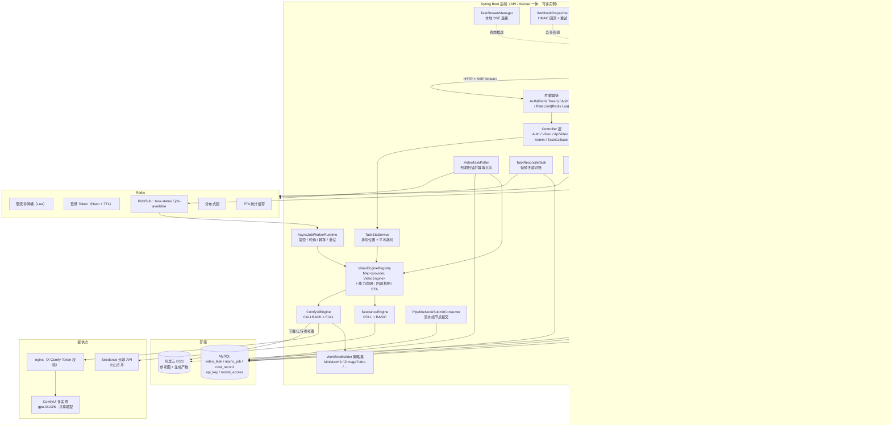
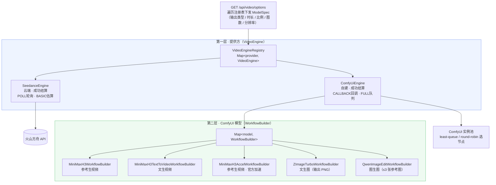
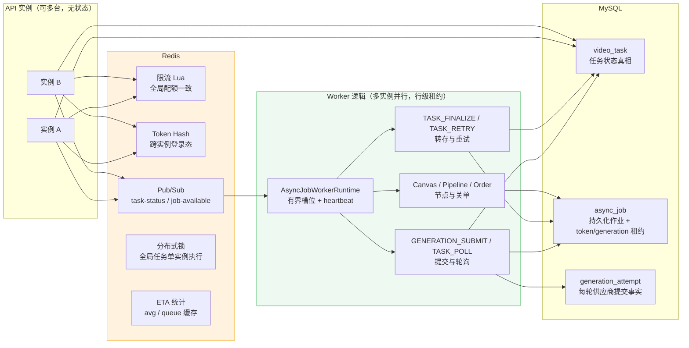
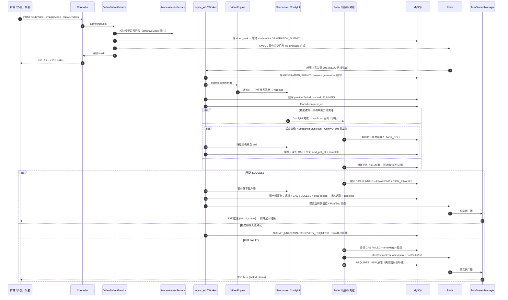

# SeedanceGenarate — 多提供方 AI 视频 / 图片生成后端

> 一个把「文字 / 图片 → 视频 / 图片」的生成能力抽象成**可插拔提供方**的 Spring Boot 后端。
> 通过两层「策略 + 注册表」设计，把云端 API（Seedance）与自建 GPU 集群（ComfyUI 多实例）统一到同一套任务生命周期、计费、鉴权与开放能力之下，并附带一套对外售卖用的 API 服务。

---

## Agent 上下文预算（开发配置）

`agent.model-call.max-input-tokens` 默认 24000，是本地估算输入预算，不是模型真实窗口。
`agent.model-call.context-windows` 可按**通道名**配置已经核实的模型总窗口，例如
`agent.model-call.context-windows.my-channel=65536`（示例值，必须换成部署的真实限制）。
未配置的通道日志显示 `configuredContextWindow=unknown`，不会按模型名字猜测。
更换该通道模型时须同步核实此配置；配置值不自动读取上游，也不会扩大上游窗口。

预算包含 system、Schema、结构化请求、图片估算预留和 `safety-tokens`（默认1024）；
已配置总窗口还扣除本次实际发送的输出额度。`image-token-reserve` 默认每张4096；
文本按 UTF-8 字节数/3 向上取整估算，**不是模型 tokenizer**，图片实际计费也可能不同。
`tokenParam=NONE` 只做输出估算预留，不声称输出已由请求约束。
既有32000字符输入硬上限仍保留。日志 `Agent context budget` 仅输出分段数字，不输出正文；
上游返回的 `promptTokens`/`completionTokens` 才是实际用量。

当前步、直接依赖、已确认约束与审批事实保留；其余步骤只传身份/状态摘要；
历史优先复用持久摘要与最近消息，相关作品优先，准确引用的原文仍由执行Skill读取。
不新增模型摘要调用；Recipe全局自然语言规则不能安全自动拆解，仍保留完整规则和当前阶段。
必要请求自身超预算会拒绝并保留计划，不通过截断必需正文或改变模型/输出额度勉强发送。

## 目录

- [项目简介](#项目简介)
- [核心亮点](#核心亮点)
- [技术栈](#技术栈)
- [整体架构](#整体架构)
- [功能特性](#功能特性)
- [对外 API 服务](#对外-api-服务)
- [目录结构](#目录结构)
- [快速开始](#快速开始)
- [关键配置](#关键配置)
- [测试](#测试)
- [已知事项与演进](#已知事项与演进)
- [相关文档](#相关文档)

---

## 项目简介

**SeedanceGenarate** 是一个全栈项目（个人开发，前后端分离）：

- **后端（本仓库）**：Spring Boot 3 服务，统一承接「文本 / 图片 → 视频 / 图片」的生成请求，把生成能力抽象成可插拔的 provider：
  - **Seedance**：火山方舟（Volcano Ark）云端 API，按秒计费。
  - **ComfyUI**：自建多实例 GPU 集群（同主机多端口、共享一套模型），按成功计费。
- **前端**（配对仓库）：Vue3 + Pinia + Element Plus，由 `/api/video/options` 接口驱动「提供方 / 模型 / 比例 / 时长」选择器，**加新模型前端无需改代码**。

配套能力包括：注册 / 登录（token 鉴权）、邀请码、按次 / 按秒计费、令牌桶限流、阿里云 OSS 参考图存储、提示词优化（后端代理大模型，密钥不下发前端）、SSE 实时状态推送，以及一套面向外部开发者的 **API 售卖层**（`sk-` 钥匙、HMAC 签名 webhook、幂等提交、两阶段调用日志）。

---

## 核心亮点

1. **两层「策略 + 注册表」抽象，扩展成本极低**
   - 第一层 **提供方**：`VideoEngine` 接口 + `VideoEngineRegistry`，新增一个提供方 = 新增一个 `@Component implements VideoEngine`，其余零改动。
   - 第二层 **ComfyUI 模型**：`ComfyUiEngine` 内部再持有 `Map<model, WorkflowBuilder>`，每个模型一份 `WorkflowBuilder`（把 prompt / 图片 / 时长 / 比例注入工作流 JSON），新增一个模型 = 新增一个类 + 一份模板 JSON。
   - 前端 `/options` 遍历注册表下发 `ModelSpec` 能力约束（输出类型 / 时长档位 / 比例 / 图数量 / 分辨率），驱动选择器渲染——**加模型、改能力，前端零代码**。

2. **单一路径、单一事实源**
   - 所有生成任务共用 `video_task` 一张表 + `biz_task_id` / `provider_task_id` / `provider` / `node_id` / `model` 判别列，不为 ComfyUI / 对外 API 另开并行子系统，历史记录不割裂；旧 `task_id` 在过渡期继续兼容。
   - UI 与对外 API **共用 `VideoSubmitService` 受理编排**（模型解析 → 开放闸门 → 落库/冻结 → `generation_attempt` + 提交作业）；请求线程立即返回稳定 taskId，供应商 HTTP 由 Worker 接管。

3. **计费时机由引擎声明，幂等记账**
   - 所有提供方都是“提交时冻结、成功时结算、失败时解冻”；外部提供方自身的成本时点不改变用户账务口径。
   - `cost_record.task_id` 和钱包 biz_key 由唯一索引做最终幂等兜底，重放终态 Worker 不会重复扣费。

4. **前端不轮询，改为服务端驱动 + SSE 推送**
   - 后台 `VideoTaskPoller` 只把到期任务幂等写入 `TASK_POLL`；Worker 查供应商，成功后再通过 `TASK_FINALIZE` 转存 OSS。终态提交后发事件 → SSE 推给对应浏览器。
   - SSE 尽力而为、非权威，**DB 仍是唯一真相**；断线由前端 `EventSource` 自动重连 + refetch 兜底。

5. **对外 API 的工程化细节**
   - API Key 只存 SHA-256 哈希 + 明文仅创建时返回一次；webhook 带 HMAC-SHA256 签名防伪造，`(task_id, status)` 唯一索引保证幂等，退避重试 3 次。
   - 提交幂等（`Idempotency-Key` / `request_id`）、两阶段调用日志（RECEIVED → 终态）、按 key 令牌桶限流（429 带 `Retry-After`）、统一 `{error:{code,message,request_id}}` 错误契约。

6. **面向多实例的分布式能力（Redis + 持久化作业）**
   - **Redis Lua 分布式限流**：`feature.redis-rate-limit` 开启后全局限流额度一致，多实例不会放大配额。
   - **登录 Token 存 Redis**：Hash 保存 userId + 有效期，TTL 低于阈值自动续期；MySQL 不再保存登录态。
   - **跨实例 SSE**：`feature.redis-task-events` 开启后终态经 Redis Pub/Sub 广播，所有 API 实例都能推给自己的 SSE 连接。
   - **全局定时任务锁**：`distributed.lock.enabled` 开启后，仍需单例执行的对账/清理任务不会多实例重复跑；Poller 可多实例扫描，由作业唯一键收口。
   - **持久化作业（async_job）**：生成提交、轮询、终态转存、超时重试、画布/流水线节点和订单关单共用 MySQL 作业表 + token/generation 租约；中央 runtime 先拿空闲槽位再单张领取，崩溃后可跨实例接管。Redis 只做提交后门铃，30s 带抖动的 MySQL 扫描兜底。
   - **不确定提交保护**：每轮供应商提交都有 `generation_attempt`；超时/断连无法证明未接单时进 `RECOVERY_REQUIRED` 告警人工核对，禁止盲目重复生成。
   - **事件驱动完成通知**：ComfyUI 提交时注入 webhook_url（完成后主动回调）并保留 60s 状态查询兜底，Seedance 按 `next_poll_at` 做 2s/5s/30s 退避轮询。
   - **ETA 预计完成时间**：ComfyUI 直接查真实队列给出排队位置（`GET /api/video/task/{id}/eta`），平均耗时按 model 统计并 Redis 共享缓存，前端详情页展示进度与预计剩余。

---

## 技术栈

| 层 | 技术 |
|---|---|
| 语言 / 框架 | Java 17 · Spring Boot 3.5.16 · Spring Web / AOP |
| 持久层 | MyBatis-Plus 3.5.7 · MySQL · Flyway（版本化数据库迁移） |
| 缓存 / 协调 | Redis（Lua 限流 · Token · Pub/Sub · 分布式锁 · ETA 统计缓存） |
| 引擎通信 | Hutool 5.8.27（ComfyUI HTTP）· Jackson（工作流 JSON 编辑）· Aliyun OSS SDK 3.17.4 |
| Agent 规划协议 | LangChain4j 1.19.0（仅 Planner 结构化输出；通道与运行状态由平台管理） |
| 其他 | Lombok · ip2region（IP 属地，离线 xdb）· spring-security-crypto |
| 前端（配对仓库） | Vue3 · Pinia · Element Plus · axios · SSE (`EventSource`) |

---

## 整体架构

### 系统总览



### 核心设计：两层「策略 + 注册表」



> 扩展方式：新增一个提供方 = 加一个 `VideoEngine` 实现；新增一个 ComfyUI 模型 = 加一个 `WorkflowBuilder` + 一份模板 JSON。注册表会自动把它暴露到 `/options`。

> **能力声明（策略驱动框架分流）**：`VideoEngine` 除业务方法外声明三类能力——`completionMechanism()`（CALLBACK 事件驱动 / POLL 轮询）、`etaCapability()`（FULL 可查真实队列 / BASIC 时间估算）、`needsPolling()`（决定高频退避还是 60s 兜底）。框架据此注入回调并决定状态查询节奏，ETA 也按能力组装；新增引擎无需修改任务框架。

### 分布式设计（Redis + 持久化作业）



**关键原则**：

- **MySQL 是业务状态唯一真相**，Redis 只做限流 / 登录态 / 通知 / 锁 / 可重建缓存；
- **作业化**：提交、轮询、终态收尾、超时重试与节点任务都走 `async_job`；空闲槽位才领取，heartbeat 续租，token+generation 拒绝迟到 Worker 回写；
- **提交分代**：`generation_attempt` 先记录稳定请求号再调供应商；只有能确认未接单的错误才自动重试，未知结果保守停放并告警；
- **事件驱动完成**：ComfyUI 优先完成回调并保留 60s 状态查询兜底，Seedance 退避轮询（2s/5s/30s），对账任务再做低频补漏；
- **能力声明分流**：Worker 按引擎能力决定后续查询间隔，ETA 按引擎能力组装，新增引擎不改框架。

### 一次生成的任务生命周期



---

## 功能特性

**生成能力（当前 6 个模型）**

| 提供方 | 模型 | 能力 |
|---|---|---|
| Seedance | `seedance` / `seedance-fast` / `seedance-mini` | 文生视频 / 图生视频（云端，按秒计费） |
| ComfyUI | `minimax-h3` | 参考生视频（自建，按次计费） |
| ComfyUI | `minimax-h3-t2v` | 文生视频 |
| ComfyUI | `minimax-h3-accel` | 参考生视频 · 官方加速（可选 megapixels 分辨率档位） |
| ComfyUI | `z-image-turbo` | **文生图**（输出 PNG） |
| ComfyUI | `qwen-image-edit` | **图生图**（≤3 张参考图） |

**配套能力**

- 注册 / 登录（token 存 Redis，TTL 续期）+ 邀请码体系 + 按 IP 限流；管理员后台（用户角色、模型开关、API Key）。
- 计费：Seedance 按秒单价 × 时长、ComfyUI 一口价；记账幂等，按 `task.id` 去重。
- **模型开放闸门**：`ModelAccessService` 为唯一权威，提交时按「实际生效模型」硬校验（防手拼请求绕过），管理员可运行时开 / 关模型。
- **提示词优化**：后端代理 LLM，系统提示词按模型选模板（`resources/prompts/{model}.md`，可零代码新增风格），LLM Key 仅后端持有。
- **SSE 实时状态**：`GET /api/video/stream` 替代前端轮询；`GET /task/{id}` 纯读库兜底；多实例经 Redis Pub/Sub 跨实例推送。
- **ETA 预计完成时间**：`GET /api/video/task/{id}/eta` 返回排队位置 / 进度 / 预计剩余（ComfyUI 查真实队列，平均耗时按 model 统计 + Redis 共享缓存）；前端详情页展示。
- **事件驱动完成通知**：ComfyUI webhook 回调（秒级）并保留 60s 查询兜底，Seedance 走 2s/5s/30s 退避；定时器只生产 `TASK_POLL`，供应商 GET 由持租约 Worker 执行，Redis 门铃丢失再由 30s MySQL 作业扫描恢复。
- 产物（视频 / 图片）统一流式转存到阿里云 OSS，数据库保存 `artifact_key` 和媒体元数据；播放/下载接口鉴权后签发短期 OSS URL。历史 `data/videos/` 文件保留兼容读取，OSS Lifecycle 负责正式产物过期清理。
- **API 接入文档页**：`GET /api/video/api-docs`（登录用户可读）与对外 API 文档同一份 Markdown；前端「API 文档」页面渲染。

---

## 对外 API 服务

把生成能力以 API 方式对外售卖（薄接入层，全部复用现有引擎 / 计费 / 任务生命周期）：

- `POST /api/v1/videos` 提交（`Bearer sk-`，可选 `Idempotency-Key`，202 返回 taskId）
- `GET /api/v1/videos` / `/{taskId}` / `/{taskId}/content` 列表 / 查询 / 下载
- `GET /api/v1/models` 模型清单（受模型开关过滤）
- webhook 终态回调（`X-Signature` HMAC 签名、`(task_id,status)` 幂等、退避重试）

设计要点：key 只存 SHA-256 哈希、`api_call_log` 两阶段日志为统计唯一真相（聚合现算不建计数器表）、四个幂等点（提交 / 计费 / webhook / 限流）。详见 [`API_SERVICE_DESIGN.md`](API_SERVICE_DESIGN.md)。

---

## 目录结构

```
src/main/java/org/example/seedancegenarate/
├── engine/               # 提供方层（核心抽象）
│   ├── VideoEngine       #   接口：provider / submit / poll / models / billingTiming
│   │                     #   + 能力声明：completionMechanism / etaCapability / needsPolling
│   ├── VideoEngineRegistry
│   ├── Impl/SeedanceEngine
│   ├── Impl/ComfyUiEngine
│   └── comfyui/          # ComfyUI 支撑：Client / NodeScheduler / WorkflowBuilder 策略集
│       └── Impl/         #   MiniMaxH3 / T2V / Accel / ZImageTurbo / QwenImageEdit
├── controller/           # Video / Auth / UserAdmin / InviteCode / TaskCallback / GlobalExceptionHandler
├── service/              # VideoSubmitService（UI/API 共享编排）· Pricing · OSS · PromptOptimize …
│   └── Impl/             #   TaskEtaServiceImpl · RedisDistributedLock · TokenCacheService …
├── interceptor/          # Auth + 限流 + ApiKey（对外 API）
├── config/               # 各 @ConfigurationProperties + WebConfig
├── event/                # 终态领域事件
├── stream/               # SSE 管理 + Redis Pub/Sub（TaskStatus / JobAvailable）
├── task/                 # 推进器 / 终态消费 / 流水线消费 / 对账 / webhook
├── exception/  dto/  entity/  mapper/  context/  util/
└── resources/
    ├── application.yaml  # 全部配置支持 ${ENV:默认值}
    ├── db/migration/     # Flyway 版本化数据库迁移（V1 基线 → V31 Worker fencing）
    ├── schema.sql        # 历史参考：不再启动自动执行
    ├── comfyui/workflows/  # 工作流模板 JSON
    └── prompts/            # 提示词优化模板（{model}.md）
```

---

## 快速开始

```bash
# 1. 准备 MySQL（启动时由 Flyway 执行 db/migration/V1__baseline.sql；已有本地库会自动 baseline）
# 2. 配置：至少数据库连接 + 你实际使用的提供方密钥（见「关键配置」）

# 3. 编译
./mvnw clean compile

# 4. 测试（contextLoads 已隔离，不连接真实 MySQL/Redis）
./mvnw clean test
#    注：3 个 HTTP 超时边界用例需要允许绑定本机 loopback；
#    真实 MySQL 迁移/方言兼容仍须在独立测试库演练。

# 5. 启动（默认 :8080）
./mvnw spring-boot:run
```

启动后：

- UI 接口：`POST /api/auth/register` → `POST /api/auth/login` 拿 token → `POST /api/video/text2video`
- 能力清单：`GET /api/video/options`
- SSE 推送：`GET /api/video/stream?token=xxx`

---

## 关键配置

所有配置均为 `${ENV:默认值}` 形式，生产环境用环境变量覆盖（`application.yaml` 见 §11 详表）。数据库结构由 Flyway 管理，默认启用 `spring.flyway.enabled=true` 且 `spring.sql.init.mode=never`。

| 配置项 | 说明 |
|---|---|
| `SPRING_DATASOURCE_*` | MySQL 连接（Hikari 池大小按实例数预算） |
| `SPRING_REDIS_*` | Redis（Token / 限流 / Pub/Sub / 锁 / ETA 缓存；池大小按每请求 2 次 Redis 预算） |
| `SPRING_FLYWAY_*` / `SPRING_SQL_INIT_MODE` | Flyway 迁移开关 / 旧 SQL 初始化开关 |
| `SEEDANCE_API_KEY` / `SEEDANCE_MODEL*` | Seedance 密钥与模型 |
| `COMFYUI_NODE{0,1,3,6}_URL` / `_ENABLED` | ComfyUI 实例节点 |
| `COMFYUI_ACCESS_TOKEN` | ComfyUI 访问令牌（所有请求带 `X-Comfy-Token`，nginx 入口校验） |
| `VIDEO_CALLBACK_BASE_URL` / `_SECRET` | ComfyUI 完成回调地址与鉴权 token（未配置自动回退轮询） |
| `AUTH_TOKEN_*` | 登录 Token 有效期（idle / max lifetime / 续期阈值）与 Redis 前缀 |
| `FEATURE_REDIS_RATE_LIMIT` / `_TASK_EVENTS` | 分布式限流 / 跨实例 SSE 开关（多实例必须开） |
| `DISTRIBUTED_LOCK_*` | 全局定时任务锁（多实例必须开） |
| `ASYNC_JOB_*` | 持久化作业（`WORKER_THREADS` / `RECONCILE_INTERVAL_MS` / `RECONCILE_JITTER_PERCENT` / `MAX_ATTEMPTS` / `BACKOFF_BASE_SECONDS` / Redis 通知频道） |
| `TASK_STATUS_REDIS_CHANNEL` / `ASYNC_JOB_REDIS_CHANNEL` | Pub/Sub 频道（不同环境用不同前缀隔离） |
| `ALIYUN_OSS_*` | 参考图与生成产物对象存储（须后端可读，ComfyUI 会回源下载）；`ALIYUN_OSS_ARTIFACT_PREFIX` / `ALIYUN_OSS_SIGNED_URL_TTL_SECONDS` 控制产物前缀与签名有效期 |
| `PROMPT_OPTIMIZE_API_KEY` | 提示词优化 LLM 密钥（仅后端） |
| `BILLING_*` / `RATE_LIMIT_*` / `VIDEO_POLL_*` | 计费 / 限流 / 推进器参数 |
| `VIDEO_TASK_TIMEOUT_MINUTES` / `VIDEO_TIMEOUT_RETRY_MAX` / `VIDEO_SUBMIT_STALL_MINUTES` | 任务超时自动处理：超龄强制终态 / ComfyUI 免费自动重试上限（0=不重试）/ 提交断裂判定 |
| `VIDEO_MODEL_ACCESS_DEFAULT_OPEN` | 新模型默认是否开放 |

> ⚠️ **安全**：仓库内 `application.yaml` 的默认值含真实样式的密钥，**仅供本地开发**；务必用环境变量覆盖真实密钥，切勿把真实密钥提交进仓库。

---

## 可观测性

后端暴露 `/actuator/prometheus`（JVM / HTTP / 线程池 + 自定义业务指标），业务指标由 `MetricsExportTask` 每 30s 从 DB 现查导出：

| 指标 | 含义 |
|---|---|
| `task_processing_count{provider}` | 生成中任务数（按引擎） |
| `task_recovery_required_count` | 供应商是否已接单无法判定，需人工核对的任务数 |
| `task_stuck_count` | 卡死数：超过超时阈值仍 PROCESSING（正常应接近 0） |
| `task_success_total` / `task_failed_total` | 近 5 分钟成功 / 失败（成功率窗口） |
| `async_job_dead_count` | 死信作业数（重试耗尽，需人工介入） |
| `node_up{node_id}` / `node_queue_load{node_id}` | ComfyUI 节点在线状态与队列深度 |

一键起监控栈（Prometheus + Grafana + Alertmanager）：

```bash
docker compose -f compose/docker-compose.yml up -d
# Prometheus: http://localhost:9090   Grafana: http://localhost:3000 (admin/admin)
# 后端地址在 compose/prometheus.yml targets 里配置
```

告警规则（`compose/rules.yml`）：待人工核对的未知提交、卡死任务、作业死信、成功率低于 90%、节点掉线。告警出口接入钉钉 / 企业微信机器人见 `compose/alertmanager.yml`。

---

## Planner 模型接入（LangChain4j）

`AGENT_PLAN` 使用 LangChain4j 适配器发送严格 JSON Schema；文本 Skill、Recipe 编译、同步提示词优化仍走原客户端。没有引入框架自动 Tool 执行、ChatMemory 事实存储或第二套 YAML 通道。

- 通道仍在管理端配置、保存于 `llm_channel`，沿用已有完整 Chat Completions 请求地址、密钥、模型、优先级与启停语义；无需修改数据库结构。密钥不要写进仓库。
- 自有 vLLM 或第三方兼容接口必须实际支持并接受 `response_format.type=json_schema`、严格对象及嵌套 `anyOf`；只支持普通聊天或 JSON Mode 不代表能运行 Planner。通过真实上游契约验证前，不把通道标为“已验证支持”。
- wire 格式有一层 `decision` 包装，内部仍是原四种领域动作；可选参数以 Schema 允许的 `null` 表达，进入原业务校验前恢复省略。完整协议见 `.my-loop/CONTRACT-langchain4j-planner.md`。
- 上游明确拒绝 `response_format` 时报告 `MODEL_SCHEMA_UNSUPPORTED`，普通参数错误仍报告 `MODEL_INVALID_REQUEST`；不会静默退回自由文本，也不会把当前创作自动转发其他第三方。SDK 不自动重试；模型故障仍受既有持久化恢复次数和等待策略约束。目前前端沿用通用模型检查提示，排障时应结合该日志错误码。
- JSON 格式正确不等于业务允许执行；作品归属、计划步骤、费用确认、幂等和旧 epoch 拦截都继续由平台校验。
- 普通试跑仍验证原文本链路，不足以证明 Planner Schema 能力。升级前应在隔离测试环境验证一次真实 Agent 文本创作和审批暂停；本地 HTTP fixture 不代表生产 vLLM 已通过。

本次升级不包含新数据库迁移。发布前保留旧制品、备份生产数据库并做兼容演练，避免新旧 Planner 协议在同一批在途作业上交替执行；不因模型接入而重投旧付费任务。

版本维护提醒：Spring Boot 官方将 3.5.16 列为 3.5 系列最后一个 OSS 版本；本项目按当前升级范围保留 3.5.x，后续需要单独评估受支持版本或商业支持，不能把构建成功视为长期安全维护保证。参见 [官方发布说明](https://spring.io/blog/2026/06/25/spring-boot-3-5-16-available-now/)。

## 测试

- 单元测试 + 隔离的 Spring 上下文测试 + 可选本地 Redis 集成测试（`RUN_REDIS_INTEGRATION_TESTS=true`），`./mvnw clean test` 全绿。
- 覆盖：各类 `WorkflowBuilder`、`GenerationMode`、`ModelAccessService`、`PromptOptimizeService`、`VideoEngine.effectiveModel`（闸门修复回归）、Redis 限流 Lua、Token 缓存、分布式锁、作业入队/领取/重试、终态消费、回调鉴权、Pub/Sub 发布订阅等。
- 默认测试不连接真实 MySQL/Redis；`ApplicationTests` 使用惰性上下文与立即失败的测试 DataSource，`Boot35SmokeTest` 另起受控本地 Web 服务、显式检查关键框架 Bean、健康响应及匿名 Agent 拦截。这不等于全部生产 Bean 的外部初始化已验证。真实 MySQL 8.4 的迁移与 `SKIP LOCKED` 必须另做部署前演练。

---

## 已知事项与演进

- **多实例部署**：核心链路已分布式化。必须开启 `FEATURE_REDIS_RATE_LIMIT`、`FEATURE_REDIS_TASK_EVENTS`、`DISTRIBUTED_LOCK_ENABLED`，为每个环境隔离 Redis key/channel，并按“实例数 × Worker 槽位”预算 MySQL/Redis 连接池。
- **Worker 升级门禁**：旧/新 Worker 不能混跑。先暂停生成、等待旧在途任务排空并停止全部旧实例，再于维护窗用单一新制品执行 V29–V31，最后只启新版；新版已接单后不能直接回滚旧镜像。
- **迁移前检查**：先备份并在 MySQL 8.4 快照克隆上演练空库与 V28→V31；确认 `async_job` 为 InnoDB，且 `idx_job_claim`、`idx_job_lease`、`idx_job_claim_v2`、`idx_video_task_poll_due` 均存在。V31 的 VARCHAR→TEXT 可能重建 `async_job`。已由 Flyway 管理的生产库应设置 `SPRING_FLYWAY_BASELINE_ON_MIGRATE=false`。
- **迁移失败处理**：MySQL DDL 不具备整组事务回滚保证；失败后先核对实际表结构与 `flyway_schema_history`，清理到确定状态并执行 Flyway repair，禁止不检查就盲目重跑。
- **ComfyUI 访问安全**：建议 nginx 入口校验 `X-Comfy-Token`（header 或 `?token=`），ComfyUI 只监听本机；后端所有调用已统一携带 token。
- **任务推进**：ComfyUI 事件驱动（webhook 回调）并保留 60 秒查询兜底；Seedance 退避轮询（2s/5s/30s）；所有供应商查询都由持租约的 `TASK_POLL` Worker 执行。
- **演进路线**：读写分离时将 claim/lease/attempt 全部强制走 Writer，再演进 Redis Sentinel/Cluster、流水线多次运行历史、Outbox 可靠事件、API/Worker 角色拆分和更多模型。
- 实测发现并修复的典型问题（面试可展开）：模型开放闸门绕过（`effectiveModel` 默认实现）、Spring advice 排序吞掉 `ApiException`（`@Order`）、`Map.of` 的 null key NPE、分布式锁开关关闭导致任务不执行（锁未启用需回退直接执行）、对账查询 NULL next_poll_at 不匹配、scoped CSS 对 v-html 内容失效（`:deep()`）。

---

## 相关文档

### Agent 创作规格与视频模型顺序

Agent 计划的 `data.creationSpec` 保存已知的整片 `totalDurationSeconds` 和 `ratio`；用户采用准确计划版本后，下游脚本、分镜和视频准备继承。历史缺值保持未知，不从标题或摘要猜补。模型输出的分镜总秒数必须与已确认目标相同；这是制作规格验证，不是对生成文件实际时长、角色一致性或已合成成片的保证。

可在 Spring Boot 配置中设置 `agent.runtime.video-model-priority`（字符串列表，值为现有视频模型 ID）。列表靠前的兼容模型优先；不支持画幅、参考模式或时长组合的模型不会因优先级高而入选。未列出模型最后按 ID 排序，默认空列表保持原顺序。已绑定分镜模型与已批准任务不会因该配置变化而自动换模型。这与规划 LLM 通道优先级是两个独立配置。

本切片未增加数据库迁移；未补写历史作品规格。无可用时长组合时应调整并确认方案，不会静默缩短镜头或重提收费任务。

- [`ARCHITECTURE.md`](ARCHITECTURE.md) —— 架构速览：两层策略、任务生命周期、计费、鉴权限流、数据模型、分布式改造。
- [`API_SERVICE_DESIGN.md`](API_SERVICE_DESIGN.md) —— 对外 API 业务设计与落地偏差。
- [`DISTRIBUTED_MIGRATION_PLAN.md`](DISTRIBUTED_MIGRATION_PLAN.md) —— 分布式改造阶段实施方案（PR 拆分）。
- `docs/architecture.mmd` —— 架构图独立文件，可用 [mermaid.live](https://mermaid.live) 渲染 / 导出 PNG 用于演示。
- `docs/OSS_URL_RECOVERY.md` —— OSS 裸域名 URL 线上修复指南。
- 配对前端仓库：`/Users/a1234/WebstormProjects/seedance_generate`（Vue3 + Pinia + Element Plus；`USER_GUIDE.md` 为用户使用手册）。
