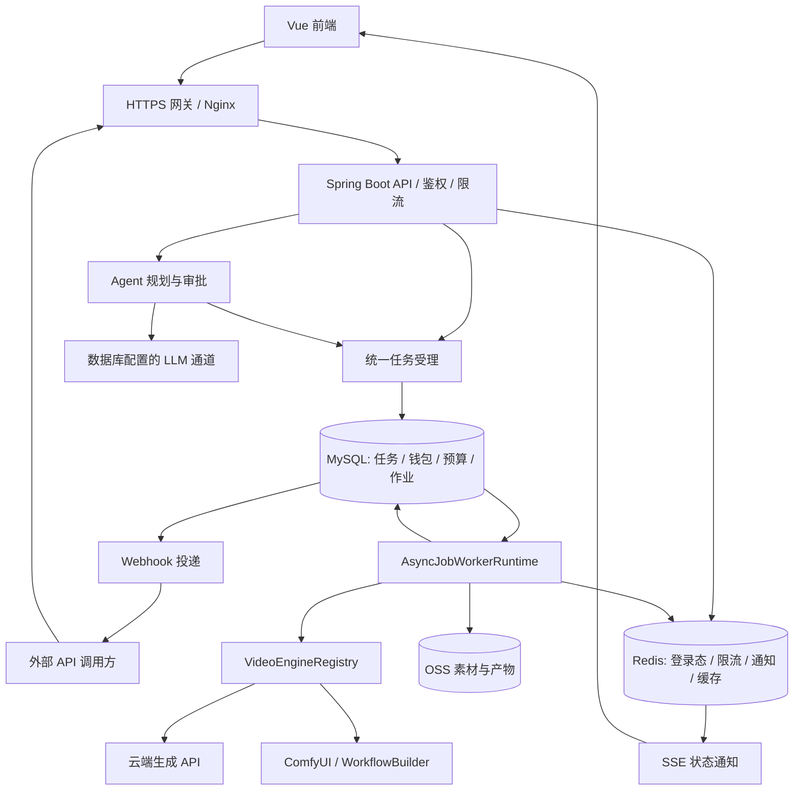
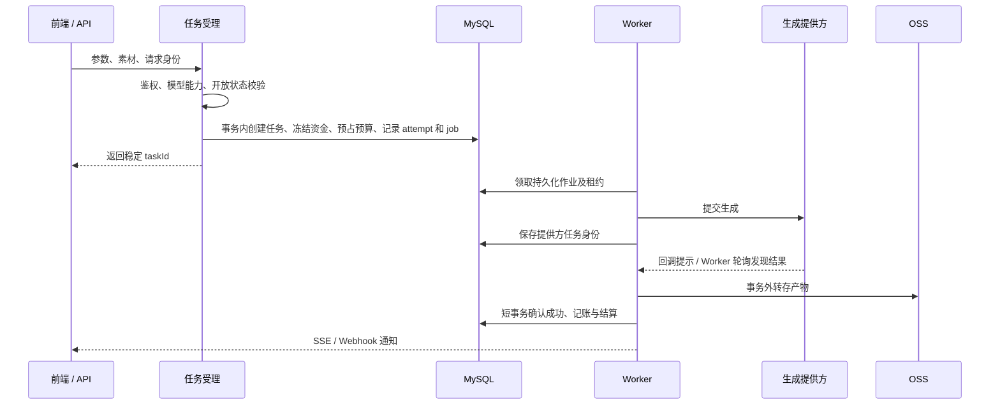

# Ascent AI 创作平台 · 后端

本仓库是 Ascent 的 Spring Boot 后端，提供图片、视频、音频生成，以及 Agent 创作、任务管理、钱包计费和开放 API。面向接手开发与部署的同事，本文按「理解系统 → 配置 → 启动 → 部署 → 排障」组织。

- 后端仓库：[api-generate-backend](https://github.com/hengshengzhisuan/api-generate-backend)
- 前端仓库：[api-generate-front](https://github.com/hengshengzhisuan/api-generate-front)
- 构建：Java 17、Maven Wrapper；当前使用 Spring Boot 3.5.16。
- 数据：MySQL（建议用 MySQL 8.4 演练部署）、Redis、阿里云 OSS。

## 1. 系统做什么

| 业务 | 说明 |
| --- | --- |
| 生成与任务 | 统一受理云端 Seedance、自建 ComfyUI 等提供方任务，查询状态、预览和下载产物 |
| Agent 创作 | 从需求到计划、脚本、分镜、生成准备与费用审批，支持批量生成和局部修复 |
| 素材与画布 | 素材引用、节点编排、任务关联、作品展示 |
| 账号与钱包 | 登录、验证码、邮箱注册、钱包冻结/结算/释放、充值 |
| 开放 API | API Key、幂等提交、模型能力、任务查询、Webhook、Key 月度预算 |
| 管理后台 | 用户、模型开放、价格、LLM 通道、ComfyUI 节点、任务与账务管理 |

模型清单与参数以运行时能力接口为准，不以 README 中的静态列表作为契约。

## 2. 架构

### 系统总览



API 与 Worker 当前在同一应用中运行；多实例共享 MySQL、Redis、OSS。不要把它当成已经提供独立 API/Worker 部署角色的系统。

### 一次生成如何完成



需要牢记的业务边界：

- MySQL 保存任务、账务和作业事实；Redis 通知丢失后仍由持久化扫描补进度。
- 用户资金采用提交冻结、成功结算、失败释放；Key 月度预算与账号钱包是两层约束。
- 提交断连不一定代表提供方未受理。`SUBMIT_UNKNOWN` / `RECOVERY_REQUIRED` 要核对提供方事实，不能直接再次生成。
- SSE 是通知，查询接口与数据库才是状态依据。
- Agent 修复、重新核价不等于批准费用；新的付费执行仍需准确的审批授权。

### 从哪里读代码

```text
src/main/java/org/example/seedancegenarate/
├── controller/      HTTP 接口
├── interceptor/     登录、角色、API Key 与限流
├── agent/           规划、审批、运行时与持久化
├── service/         受理、计价、钱包、存储等业务服务
├── engine/          VideoEngine 注册表与提供方实现
│   └── comfyui/     节点调度、HTTP 客户端与 WorkflowBuilder
├── canvas/          画布节点与校验
├── task/            作业消费、轮询、对账与 Webhook
├── stream/          SSE 与 Redis 通知
├── config/          配置绑定与应用装配
└── entity/ mapper/  数据实体与访问

src/main/resources/
├── application-template.yaml   配置参考模板
├── db/migration/               Flyway 迁移，当前至 V58
├── comfyui/workflows/          生成工作流 JSON
└── prompts/                    提示词模板
```

核心入口可搜索 `VideoSubmitService`、`AsyncJobWorkerRuntime`、`VideoEngineRegistry`、`AgentApplication`、`BillingAuthorizationService`。

## 3. 配置怎么设置

### 配置加载方式

仓库跟踪的是 `src/main/resources/application-template.yaml`，它**不会按默认文件名自动加载**。个人的 `application.yaml` 和支付密钥被 Git 忽略。

推荐将配置放在仓库外，例如 `/etc/ascent/application.yaml`，运行时显式指定：

```bash
java -jar target/SeedanceGenarate-0.0.1-SNAPSHOT.jar \
  --spring.config.location=file:/etc/ascent/application.yaml
```

`spring.config.location` 替换默认搜索位置，便于避免误读开发机配置。配置内 `${VARIABLE}` 从进程环境读取；`.env` 文件本身不会被 Spring Boot 自动读取。Docker 用 `--env-file`，systemd 用 `EnvironmentFile`，IDE 则在运行配置中填写环境变量。

先复制模板到自己的外部配置位置，再逐项核对。模板中仍有历史支付默认值，**不能直接当作已脱敏的生产配置使用**；未接支付时显式设置 `WECHAT_PAY_ENABLED=false`，启用时全部替换为己方参数。本文不复制这些值。

### 必须确认的基础配置

| 环境变量 | 用途与设置方式 |
| --- | --- |
| `SPRING_DATASOURCE_URL` | 例如 `jdbc:mysql://127.0.0.1:3306/ascent?useUnicode=true&characterEncoding=utf8&serverTimezone=Asia/Shanghai`；生产 TLS 按数据库要求配置 |
| `SPRING_DATASOURCE_USERNAME` / `SPRING_DATASOURCE_PASSWORD` | 应用数据库账号；执行迁移的账号需要对应 DDL 权限 |
| `SPRING_REDIS_HOST` / `SPRING_REDIS_PORT` / `SPRING_REDIS_PASSWORD` / `SPRING_REDIS_DATABASE` | Redis 连接；模板使用这些变量映射到 `spring.data.redis` |
| `ALIYUN_OSS_ENDPOINT` / `ALIYUN_OSS_BUCKET_NAME` / `ALIYUN_OSS_DOMAIN` | OSS 区域、Bucket 与访问域名 |
| `ALIYUN_OSS_ACCESS_KEY_ID` / `ALIYUN_OSS_ACCESS_KEY_SECRET` | 服务端 OSS 访问凭据，使用部署环境注入 |
| `SPRING_MAIL_HOST` / `SPRING_MAIL_USERNAME` / `SPRING_MAIL_PASSWORD` | 邮箱验证码 SMTP；模板还有必填占位符，需填实际值或在自有配置中明确调整 |
| `SERVER_PORT` | 默认 `8080` |
| `FILE_UPLOAD_PATH` | 默认 `./data/images`，部署时指向可写且持久化的路径 |

模板中没有默认值的 `${...}` 不能遗漏。**业务暂时不用某项，不代表该模板中的占位符可以不解析**；未接入的功能要在自己的配置中明确处理并保持模型/通道关闭。

### 生成提供方、LLM 与支付

| 场景 | 配置与管理入口 |
| --- | --- |
| Seedance | `SEEDANCE_API_KEY`、`SEEDANCE_URL`、`SEEDANCE_MODEL`；实际支持的模型需在管理端确认开放状态与价格 |
| ComfyUI | 模板有 `COMFYUI_NODE0/1/3/6_URL` 与对应 `_ENABLED`；填写实际可达地址，未使用节点禁用；网关令牌用 `COMFYUI_ACCESS_TOKEN` |
| 节点维护 | 节点持久化到数据库后在后台管理；不要指望修改 YAML 覆盖已有节点配置 |
| ComfyUI 回调 | `VIDEO_CALLBACK_BASE_URL`、`VIDEO_CALLBACK_SECRET`、`VIDEO_COMFYUI_WEBHOOK_SUPPORTED`；只有安装并验证回调扩展才开启，原生 ComfyUI 不能假定支持 |
| LLM / 提示词优化 | `PROMPT_OPTIMIZE_URL`、`PROMPT_OPTIMIZE_API_KEY`、`PROMPT_OPTIMIZE_MODEL` 是初始通道种子；已有通道在后台「AI 通道」维护 |
| Agent Planner | 规划通道必须支持严格 `response_format.type=json_schema`；普通聊天测试通过不等于 Planner 可用 |
| 微信支付 | 默认部署显式禁用；启用前配置 `WECHAT_PAY_APP_ID`、`WECHAT_PAY_MCH_ID`、API v3 密钥、商户私钥/证书路径、序列号与通知地址 |
| 其他支付渠道 | 按对应配置类与部署环境单独接入，本文不提供可直接用于真实充值的凭据示例 |

### 常用调优参数

| 配置 | 模板默认值 / 注意事项 |
| --- | --- |
| `ASYNC_JOB_WORKER_THREADS` | `8`；每实例 Worker 并行槽位，结合提供方、数据库容量调节 |
| `ASYNC_JOB_RECONCILE_INTERVAL_MS` | `30000`；通知丢失后的作业扫描间隔 |
| `SPRING_DATASOURCE_POOL_MAX` / `_MIN_IDLE` | `50` / `10`；所有实例池上限之和要给数据库留运维余量 |
| `SPRING_REDIS_MAX_ACTIVE` | `128`；结合并发与 Redis 容量配置 |
| `VIDEO_TASK_TIMEOUT_MINUTES` | `60`；结合模型实际耗时设置，不能用缩短超时解决未知受理 |
| `VIDEO_ARTIFACT_RETENTION_DAYS` | `30`；与 OSS 产物生命周期一致，按创建时间判断 |
| `ALIYUN_OSS_SIGNED_URL_TTL_SECONDS` | `300`；产物鉴权后的临时访问地址有效期 |
| `VIDEO_MODEL_ACCESS_DEFAULT_OPEN` | 模板为 `true`；新环境建议改为 `false`，逐个验证再开放 |
| `AGENT_MODEL_CALL_TIMEOUT_MS` | `300000`；后台 Agent 模型调用超时 |
| `AGENT_VIDEO_PROMPT_OUTPUT_TOKENS` / `AGENT_VIDEO_PROMPT_REPAIR_TOKENS` | `12288` / `16384`；须匹配真实上游能力 |

Agent 的 `agent.model-call.max-input-tokens` 默认 24000，是本地估算预算，不是模型真实窗口。`agent.model-call.context-windows` 按通道名填写核实过的总窗口；默认每图预留 4096 token，文本按 UTF-8 字节估算，不等同于上游 tokenizer。需要的上下文本身超限时会拒绝，不应通过删审批事实来规避。

`agent.runtime.video-model-priority` 可配置视频模型 ID 列表，只影响兼容模型的优先选择，不会自动替换已绑定或已批准任务。

## 4. 本地启动

1. 安装 JDK 17，准备可访问的 MySQL、Redis 和所需外部服务。
2. 在 MySQL 创建空数据库与应用账号；不要先执行历史 `schema.sql`。
3. 复制配置模板到仓库外，填写上一节配置，通过 IDE 或终端导出所需环境变量。
4. 从仓库根目录运行：

```bash
java -version
./mvnw -DskipTests package
java -jar target/SeedanceGenarate-0.0.1-SNAPSHOT.jar \
  --spring.config.location=file:/etc/ascent/application.yaml
```

也可以在 IDE 中运行应用入口，并设置参数 `--spring.config.location=file:/你的绝对路径/application.yaml`。

首次启动 Flyway 会执行迁移。当前最新迁移为 `V58__api_key_budget.sql`。空库可直接迁移；已有库需先核对 `flyway_schema_history`，不要用自动 baseline 掩盖结构差异。生产显式配置：

```text
SPRING_FLYWAY_ENABLED=true
SPRING_FLYWAY_BASELINE_ON_MIGRATE=false
SPRING_SQL_INIT_MODE=never
WECHAT_PAY_ENABLED=false
VIDEO_MODEL_ACCESS_DEFAULT_OPEN=false
```

启动后先检查日志和健康接口：

```bash
curl -i http://127.0.0.1:8080/actuator/health
```

健康检查通过仅说明其覆盖的依赖正常，还需验证登录、模型列表、素材读写和任务链路。新环境的首个管理员账号需由负责人按账号管理流程配置；不要假设存在默认管理员密码。

前端开发默认把 `/api` 代理至 `http://localhost:8080`；前端不需要拿到生成提供方或 OSS 的服务端密钥。

## 5. 部署

### JAR / systemd

部署 JAR、外部配置和凭据文件，使用独立服务用户运行，确保数据目录可写。systemd 单元可参考：

```ini
[Unit]
Description=Ascent backend
After=network-online.target
Wants=network-online.target

[Service]
User=ascent
WorkingDirectory=/opt/ascent
EnvironmentFile=/etc/ascent/backend.env
ExecStart=/usr/bin/java -jar /opt/ascent/app.jar --spring.config.location=file:/etc/ascent/application.yaml
Restart=on-failure
RestartSec=5

[Install]
WantedBy=multi-user.target
```

服务用户、目录与 Java 路径需要提前准备。`backend.env` 使用 `KEY=value` 格式，限制读取权限；启动日志通过 `journalctl -u ascent-backend -f` 查看（单元名需对应）。

### Docker

仓库的 Dockerfile **只复制已经编译的 JAR**，不会替你执行 Maven：

```bash
./mvnw -DskipTests package
docker build -t ascent-backend:local .
docker run -d --name ascent-backend --restart unless-stopped \
  -p 127.0.0.1:8080:8080 \
  --env-file /etc/ascent/backend.env \
  -v /etc/ascent/application.yaml:/config/application.yaml:ro \
  -v /var/lib/ascent:/app/data \
  ascent-backend:local \
  --spring.config.location=file:/config/application.yaml
```

容器中的 `localhost` 是容器自身；数据库、Redis、ComfyUI、LLM 的地址必须从容器可达。密钥文件若使用外部路径，也要挂载到容器对应路径。

**打包注意：Git 忽略不等于 Maven 不打包。** 当前 Maven 资源规则可能将本机未跟踪的 `application.yaml` 或支付文件打进 JAR。发布推荐从干净克隆构建，外部注入运行配置；发布前用 `jar tf` 核对 `BOOT-INF/classes/` 下的配置与密钥资源。

### 网关与 SSE

网关终止 HTTPS，转发 `/api/`，SSE 路径关闭缓冲。下面是配置片段，需放进实际 Nginx `server` 中：

```nginx
location /api/ {
    proxy_pass http://127.0.0.1:8080;
    proxy_http_version 1.1;
    proxy_set_header Host $host;
    proxy_set_header X-Forwarded-For $proxy_add_x_forwarded_for;
    proxy_set_header X-Forwarded-Proto $scheme;
    proxy_buffering off;
    proxy_read_timeout 3600s;
    client_max_body_size 210m;
}
```

此片段保留 `/api` 路径。应用 multipart 上限为单文件 200MB、请求 210MB；公开 v1 JSON 与 URL 参考素材另有限制，调大网关不能解除业务限制。转发头仅应信任实际受控网关。监控端点应通过运维网络访问。

### 多实例与升级

所有实例使用相同业务 MySQL、Redis 与 OSS，并开启：

```text
FEATURE_REDIS_RATE_LIMIT=true
FEATURE_REDIS_TASK_EVENTS=true
FEATURE_REDIS_CONFIG_INVALIDATION=true
DISTRIBUTED_LOCK_ENABLED=true
```

不同环境隔离 Redis DB/前缀和频道：`AUTH_TOKEN_REDIS_KEY_PREFIX`、`CAPTCHA_REDIS_KEY_PREFIX`、`REGISTRATION_EMAIL_REDIS_KEY_PREFIX`、`RATE_LIMIT_REDIS_KEY_PREFIX`、`DISTRIBUTED_LOCK_KEY_PREFIX`、`TASK_STATUS_REDIS_CHANNEL`、`ASYNC_JOB_REDIS_CHANNEL`、`CONFIG_INVALIDATION_REDIS_CHANNEL`。

升级顺序：备份数据库与旧制品 → 在克隆库演练迁移 → 暂停新生成并处理在途任务 → 停止不兼容旧 Worker → 执行迁移 → 启动同版本实例 → 验证登录、任务、审批和账务。V58 预算控制要求实例整体切换，旧实例不能绕过预算受理。不要把回滚旧 JAR 当作数据库回滚；MySQL DDL 失败后要检查实际结构和迁移记录再处理。

## 6. API 与联调

| 接口 | 用途 |
| --- | --- |
| `GET /api/video/options` | 网页端模型能力（需要相应登录认证） |
| `GET /api/video/task/{id}` | 任务详情 |
| `GET /api/video/stream` | 登录用户 SSE |
| `GET /api/v1/models` | 对外可用模型能力 |
| `POST /api/v1/videos` | 对外统一生成受理，成功返回 202 |
| `GET /api/v1/videos` / `/{taskId}` / `/{taskId}/content` | 对外任务列表、详情、内容 |

v1 使用 `Authorization: Bearer <API Key>`。先查询模型能力，再提交对应参数；支持的图片、视频、音频参考取决于具体模型。网络重试沿用同一幂等键，同键变更参数会冲突。查询验证可以使用：

```bash
curl -H "Authorization: Bearer ${ASCENT_API_KEY}" \
  http://127.0.0.1:8080/api/v1/models
```

`ASCENT_API_KEY` 是调用者在本机设置的变量，勿将真实 Key 写入示例。生成可能产生费用，联调提交前确认价格与预算。完整字段、错误码与 Webhook 协议以 [API 文档](src/main/resources/api-docs.md) 为准。

## 7. 测试与运维

当前存在会调用真实微信预支付的 `WechatPaymentServiceTest`，不要直接把全量测试当成完全隔离测试。常规回归先显式排除该用例：

```bash
./mvnw '-Dtest=*,!WechatPaymentServiceTest' test
```

这个排除命令不保证所有其他测试均无外部依赖。数据库迁移、Redis 集成和提供方验收需按测试要求使用隔离环境；真实支付测试只能在单独授权的环境运行。`-DskipTests package` 是构建命令，不是测试通过证明。

监控 Compose 只启动 Prometheus、Grafana、Alertmanager，**不包含后端、MySQL、Redis**：

```bash
docker compose -f compose/docker-compose.yml up -d
```

启动前调整 `compose/prometheus.yml` 中后端抓取地址，替换 Grafana 默认密码，配置告警出口与网络访问限制。关注 `/actuator/prometheus` 中任务待恢复、作业死信、任务卡住、节点在线及队列等指标。

| 现象 | 首先检查 |
| --- | --- |
| 启动提示占位符未解析 | 外部配置路径、进程环境变量、模板必填项是否齐全 |
| Flyway 失败 | 迁移日志、数据库权限、实际表结构、`flyway_schema_history`；勿盲目 baseline/repair |
| 登录或验证码异常 | Redis 连通性、SMTP、环境前缀、网关转发头 |
| 模型看不到 / 提交被拒绝 | 模型开放状态、价格、参数能力、节点健康、账号余额与 Key 预算 |
| Agent 不继续 | 当前审批/等待状态、LLM 通道 Schema 支持与超时、对应作业/步骤；先确认是否本就等待用户 |
| 任务长时间不推进 | 联查 `video_task`、`generation_attempt`、`async_job`，核对租约、尝试身份和提供方状态 |
| `RECOVERY_REQUIRED` | 核对提供方是否接单；不得仅因网页无结果就重投 |
| 产物打不开 | OSS 权限、签名有效期、生命周期与保留期、浏览器到 OSS 的可达性 |
| SSE 不实时 | Nginx 缓冲、超时、Redis 事件开关、断线后的详情刷新 |

## 8. 进一步阅读

- [架构说明](ARCHITECTURE.md)：历史设计与模块细节，具体行为以当前代码为准。
- [开放 API 设计](API_SERVICE_DESIGN.md) 与 [接口文档](src/main/resources/api-docs.md)。
- [API Key 月度预算](docs/api-key-budget.md)。
- [Agent 局部修复](docs/agent-local-repair.md)、[批量重新核价](docs/agent-batch-requote.md)、[视频提示词协议](docs/agent-video-prompt-protocol.md)。
- [OSS URL 修复](docs/OSS_URL_RECOVERY.md)。

本文示例按仓库代码与配置模板整理；不代表已完成真实环境部署、支付验收或 GPU 工作流验证。
