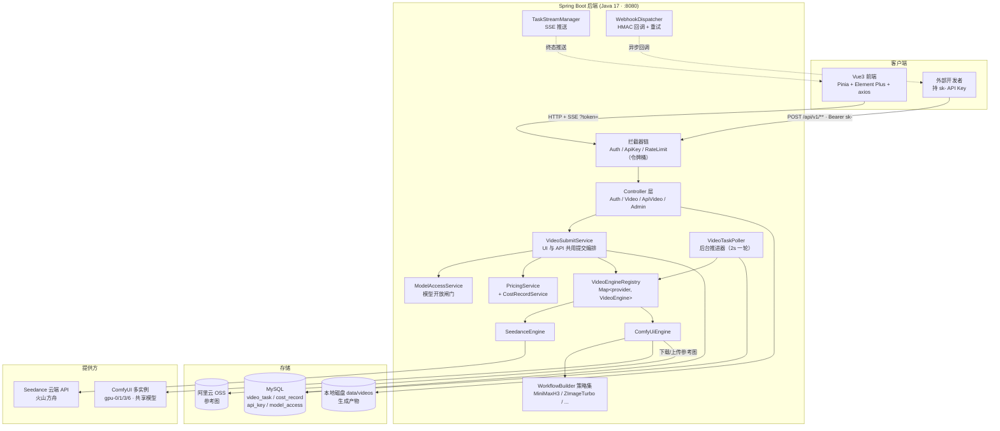
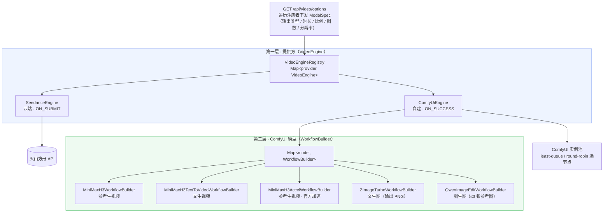
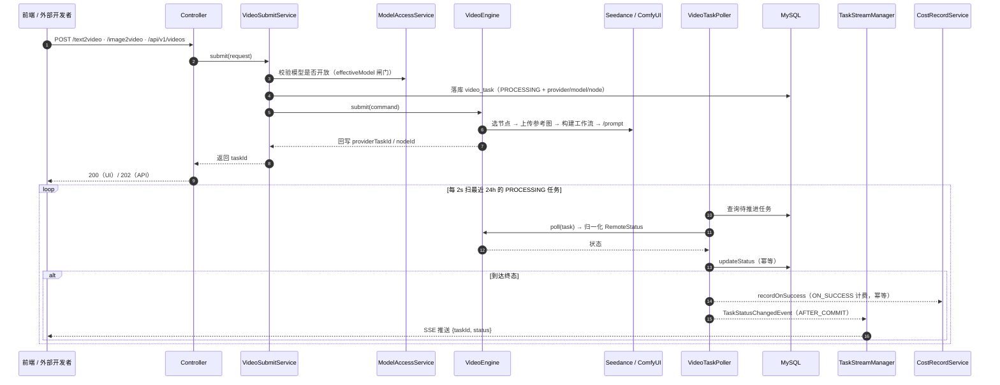

# SeedanceGenarate — 多提供方 AI 视频 / 图片生成后端

> 一个把「文字 / 图片 → 视频 / 图片」的生成能力抽象成**可插拔提供方**的 Spring Boot 后端。
> 通过两层「策略 + 注册表」设计，把云端 API（Seedance）与自建 GPU 集群（ComfyUI 多实例）统一到同一套任务生命周期、计费、鉴权与开放能力之下，并附带一套对外售卖用的 API 服务。

---

## 目录

- [项目简介](#项目简介)
- [核心亮点](#核心亮点)
- [技术栈](#技术栈)
- [整体架构](#整体架构)
- [功能特性](#功能特性)
- [对外 API 服务](#对外-api-服务)
- [目录结构](#目录结构)
- [快速开始](#快速开始)
- [关键配置](#关键配置)
- [测试](#测试)
- [已知事项与演进](#已知事项与演进)
- [相关文档](#相关文档)

---

## 项目简介

**SeedanceGenarate** 是一个全栈项目（个人开发，前后端分离）：

- **后端（本仓库）**：Spring Boot 3 服务，统一承接「文本 / 图片 → 视频 / 图片」的生成请求，把生成能力抽象成可插拔的 provider：
  - **Seedance**：火山方舟（Volcano Ark）云端 API，按秒计费。
  - **ComfyUI**：自建多实例 GPU 集群（同主机多端口、共享一套模型），按成功计费。
- **前端**（配对仓库）：Vue3 + Pinia + Element Plus，由 `/api/video/options` 接口驱动「提供方 / 模型 / 比例 / 时长」选择器，**加新模型前端无需改代码**。

配套能力包括：注册 / 登录（token 鉴权）、邀请码、按次 / 按秒计费、令牌桶限流、阿里云 OSS 参考图存储、提示词优化（后端代理大模型，密钥不下发前端）、SSE 实时状态推送，以及一套面向外部开发者的 **API 售卖层**（`sk-` 钥匙、HMAC 签名 webhook、幂等提交、两阶段调用日志）。

---

## 核心亮点

1. **两层「策略 + 注册表」抽象，扩展成本极低**
   - 第一层 **提供方**：`VideoEngine` 接口 + `VideoEngineRegistry`，新增一个提供方 = 新增一个 `@Component implements VideoEngine`，其余零改动。
   - 第二层 **ComfyUI 模型**：`ComfyUiEngine` 内部再持有 `Map<model, WorkflowBuilder>`，每个模型一份 `WorkflowBuilder`（把 prompt / 图片 / 时长 / 比例注入工作流 JSON），新增一个模型 = 新增一个类 + 一份模板 JSON。
   - 前端 `/options` 遍历注册表下发 `ModelSpec` 能力约束（输出类型 / 时长档位 / 比例 / 图数量 / 分辨率），驱动选择器渲染——**加模型、改能力，前端零代码**。

2. **单一路径、单一事实源**
   - 所有生成任务共用 `video_task` 一张表 + `biz_task_id` / `provider_task_id` / `provider` / `node_id` / `model` 判别列，不为 ComfyUI / 对外 API 另开并行子系统，历史记录不割裂；旧 `task_id` 在过渡期继续兼容。
   - UI 与对外 API **共用 `VideoSubmitService` 提交编排**（模型解析 → 开放闸门 → 落库 → 引擎提交 → 计费），两条入口行为天然一致。

3. **计费时机由引擎声明，幂等记账**
   - `VideoEngine.billingTiming()`：Seedance = `ON_SUBMIT`（云端按秒预扣），ComfyUI = `ON_SUCCESS`（自建按结果结）。
   - `cost_record.task_id` 由唯一索引做最终幂等兜底，重复终态处理不会重复扣费；用户累计消费使用数据库原子累加。

4. **前端不轮询，改为服务端驱动 + SSE 推送**
   - 后台 `VideoTaskPoller` 持续推进 `PROCESSING` 任务，完成即下载产物落本地（规避云端地址过期）；终态经 `@TransactionalEventListener(AFTER_COMMIT)` 发事件 → SSE 推给对应浏览器。
   - SSE 尽力而为、非权威，**DB 仍是唯一真相**；断线由前端 `EventSource` 自动重连 + refetch 兜底。

5. **对外 API 的工程化细节**
   - API Key 只存 SHA-256 哈希 + 明文仅创建时返回一次；webhook 带 HMAC-SHA256 签名防伪造，`(task_id, status)` 唯一索引保证幂等，退避重试 3 次。
   - 提交幂等（`Idempotency-Key` / `request_id`）、两阶段调用日志（RECEIVED → 终态）、按 key 令牌桶限流（429 带 `Retry-After`）、统一 `{error:{code,message,request_id}}` 错误契约。

---

## 技术栈

| 层 | 技术 |
|---|---|
| 语言 / 框架 | Java 17 · Spring Boot 3.3.5 · Spring Web / AOP |
| 持久层 | MyBatis-Plus 3.5.7 · MySQL · Flyway（版本化数据库迁移） |
| 引擎通信 | Hutool 5.8.27（ComfyUI HTTP）· Jackson（工作流 JSON 编辑）· Aliyun OSS SDK 3.17.4 |
| 其他 | Lombok · ip2region（IP 属地，离线 xdb）· spring-security-crypto |
| 前端（配对仓库） | Vue3 · Pinia · Element Plus · axios · SSE (`EventSource`) |

---

## 整体架构

### 系统总览



### 核心设计：两层「策略 + 注册表」



> 扩展方式：新增一个提供方 = 加一个 `VideoEngine` 实现；新增一个 ComfyUI 模型 = 加一个 `WorkflowBuilder` + 一份模板 JSON。注册表会自动把它暴露到 `/options`。

### 一次生成的任务生命周期



---

## 功能特性

**生成能力（当前 6 个模型）**

| 提供方 | 模型 | 能力 |
|---|---|---|
| Seedance | `seedance` / `seedance-fast` / `seedance-mini` | 文生视频 / 图生视频（云端，按秒计费） |
| ComfyUI | `minimax-h3` | 参考生视频（自建，按次计费） |
| ComfyUI | `minimax-h3-t2v` | 文生视频 |
| ComfyUI | `minimax-h3-accel` | 参考生视频 · 官方加速（可选 megapixels 分辨率档位） |
| ComfyUI | `z-image-turbo` | **文生图**（输出 PNG） |
| ComfyUI | `qwen-image-edit` | **图生图**（≤3 张参考图） |

**配套能力**

- 注册 / 登录（token）+ 邀请码体系 + 按 IP 限流；管理员后台（用户角色、模型开关、API Key）。
- 计费：Seedance 按秒单价 × 时长、ComfyUI 一口价；记账幂等，按 `task.id` 去重。
- **模型开放闸门**：`ModelAccessService` 为唯一权威，提交时按「实际生效模型」硬校验（防手拼请求绕过），管理员可运行时开 / 关模型。
- **提示词优化**：后端代理 LLM，系统提示词按模型选模板（`resources/prompts/{model}.md`，可零代码新增风格），LLM Key 仅后端持有。
- **SSE 实时状态**：`GET /api/video/stream` 替代前端轮询；`GET /task/{id}` 纯读库兜底。
- 产物（视频 / 图片）统一下载到本地 `data/videos/`，按真实扩展名设置 `Content-Type`，支持内联播放与附件下载。

---

## 对外 API 服务

把生成能力以 API 方式对外售卖（薄接入层，全部复用现有引擎 / 计费 / 任务生命周期）：

- `POST /api/v1/videos` 提交（`Bearer sk-`，可选 `Idempotency-Key`，202 返回 taskId）
- `GET /api/v1/videos` / `/{taskId}` / `/{taskId}/content` 列表 / 查询 / 下载
- `GET /api/v1/models` 模型清单（受模型开关过滤）
- webhook 终态回调（`X-Signature` HMAC 签名、`(task_id,status)` 幂等、退避重试）

设计要点：key 只存 SHA-256 哈希、`api_call_log` 两阶段日志为统计唯一真相（聚合现算不建计数器表）、四个幂等点（提交 / 计费 / webhook / 限流）。详见 [`API_SERVICE_DESIGN.md`](API_SERVICE_DESIGN.md)。

---

## 目录结构

```
src/main/java/org/example/seedancegenarate/
├── engine/               # 提供方层（核心抽象）
│   ├── VideoEngine       #   接口：provider / submit / poll / models / billingTiming
│   ├── VideoEngineRegistry
│   ├── Impl/SeedanceEngine
│   ├── Impl/ComfyUiEngine
│   └── comfyui/          # ComfyUI 支撑：Client / NodeScheduler / WorkflowBuilder 策略集
│       └── Impl/         #   MiniMaxH3 / T2V / Accel / ZImageTurbo / QwenImageEdit
├── controller/           # Video / Auth / UserAdmin / InviteCode / GlobalExceptionHandler
├── service/              # VideoSubmitService（UI/API 共享编排）· Pricing · OSS · PromptOptimize …
├── interceptor/          # Auth + 限流 + ApiKey（对外 API）
├── config/               # 各 @ConfigurationProperties + WebConfig
├── event/  stream/  task/ # 终态事件 · SSE 管理 · 推进器 / webhook / token 清理
├── exception/  dto/  entity/  mapper/  context/  util/
└── resources/
    ├── application.yaml  # 全部配置支持 ${ENV:默认值}
    ├── db/migration/     # Flyway 版本化数据库迁移（V1 基线、V2 计费幂等、V3 任务 ID 分离）
    ├── schema.sql        # 历史参考：不再启动自动执行
    ├── comfyui/workflows/  # 工作流模板 JSON
    └── prompts/            # 提示词优化模板（{model}.md）
```

---

## 快速开始

```bash
# 1. 准备 MySQL（启动时由 Flyway 执行 db/migration/V1__baseline.sql；已有本地库会自动 baseline）
# 2. 配置：至少数据库连接 + 你实际使用的提供方密钥（见「关键配置」）

# 3. 编译
./mvnw clean compile

# 4. 单元测试（纯 JUnit，不依赖 Spring/DB）
./mvnw clean test
#    注：SeedanceGenarateApplicationTests 会启动 Spring 上下文并连 MySQL，
#    跑全量测试需 MySQL 可用；WorkflowBuilder*Test 无需任何外部依赖。

# 5. 启动（默认 :8080）
./mvnw spring-boot:run
```

启动后：

- UI 接口：`POST /api/auth/register` → `POST /api/auth/login` 拿 token → `POST /api/video/text2video`
- 能力清单：`GET /api/video/options`
- SSE 推送：`GET /api/video/stream?token=xxx`

---

## 关键配置

所有配置均为 `${ENV:默认值}` 形式，生产环境用环境变量覆盖（`application.yaml` 见 §11 详表）。数据库结构由 Flyway 管理，默认启用 `spring.flyway.enabled=true` 且 `spring.sql.init.mode=never`。

| 配置项 | 说明 |
|---|---|
| `SPRING_DATASOURCE_*` | MySQL 连接 |
| `SPRING_FLYWAY_*` / `SPRING_SQL_INIT_MODE` | Flyway 迁移开关 / 旧 SQL 初始化开关 |
| `SEEDANCE_API_KEY` / `SEEDANCE_MODEL*` | Seedance 密钥与模型 |
| `COMFYUI_NODE{0,1,3,6}_URL` / `_ENABLED` | ComfyUI 实例节点 |
| `ALIYUN_OSS_*` | 参考图对象存储（须后端可读，ComfyUI 会回源下载） |
| `PROMPT_OPTIMIZE_API_KEY` | 提示词优化 LLM 密钥（仅后端） |
| `BILLING_*` / `RATE_LIMIT_*` / `VIDEO_POLL_*` | 计费 / 限流 / 推进器参数 |
| `VIDEO_MODEL_ACCESS_DEFAULT_OPEN` | 新模型默认是否开放 |

> ⚠️ **安全**：仓库内 `application.yaml` 的默认值含真实样式的密钥，**仅供本地开发**；务必用环境变量覆盖真实密钥，切勿把真实密钥提交进仓库。

---

## 测试

- 37 个单元测试方法，`./mvnw clean test` 全绿。
- 覆盖：5 个 `WorkflowBuilder`（含「null ratio 不 NPE」等回归用例）、`GenerationMode`、`ModelAccessService`、`PromptOptimizeService`、`VideoEngine.effectiveModel`（闸门修复回归）等。
- 均为纯 JUnit，不依赖 Spring 上下文与数据库（`ApplicationTests` 除外）。

---

## 已知事项与演进

- **多实例部署假设**：当前为单实例。SSE 推进器 / 令牌桶限流 / webhook 分发需在多实例时换分布式方案（Redis 限流、分布式锁或仅单实例跑推进器）。
- **ComfyUI 新节点**：加节点 = yaml `nodes[]` 填好 + `enabled:true` + 装对应模型权重；OSS bucket 需后端可读。
- **演进路线**：月度配额（QUOTA_EXCEEDED）、key 校验缓存、异常 key 自动禁用、OpenAPI 文档、API 独立定价、Redis 分布式限流、更多模型（Wan / Hunyuan / LTX）。
- 实测发现并修复的典型问题（面试可展开）：模型开放闸门绕过（`effectiveModel` 默认实现）、Spring advice 排序吞掉 `ApiException`（`@Order`）、`Map.of` 的 null key NPE（双层修复）。

---

## 相关文档

- [`ARCHITECTURE.md`](ARCHITECTURE.md) —— 架构速览：两层策略、任务生命周期、计费、鉴权限流、数据模型。
- [`API_SERVICE_DESIGN.md`](API_SERVICE_DESIGN.md) —— 对外 API 业务设计与落地偏差。
- `docs/architecture.mmd` —— 架构图独立文件，可用 [mermaid.live](https://mermaid.live) 渲染 / 导出 PNG 用于演示。
- 配对前端仓库：`/Users/a1234/WebstormProjects/seedance_generate`（Vue3 + Pinia + Element Plus）。
